# Architecture Documentation

> Comprehensive architecture guide for the Personal Task Tracker — a full-stack CRUD task management application with a Kanban drag-and-drop interface, deployed across multiple AWS regions.

## Table of Contents

1. [Component Relationships](#1-component-relationships)
2. [Repository Structure Overview](#2-repository-structure-overview)
3. [Core Library Modules](#3-core-library-modules)
4. [Data Flow](#4-data-flow)
5. [AWS Production Architecture](#5-aws-production-architecture)
6. [Deployment Pipeline](#6-deployment-pipeline)
7. [Security Layers](#7-security-layers)
8. [Shared Dependency Model](#8-shared-dependency-model)
9. [Docker Architecture](#9-docker-architecture)
10. [Error Handling Flow](#10-error-handling-flow)
11. [API Endpoints Reference](#11-api-endpoints-reference)
12. [Environment Configuration](#12-environment-configuration)

---

## 1. Component Relationships

The project is split across four repositories, each with a focused responsibility. The orchestration repo ties everything together with Docker Compose files and CI/CD workflows.

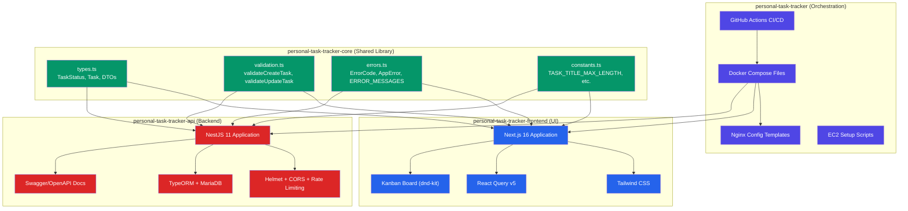

**How they connect:**

- **Core** is the shared foundation — it exports TypeScript types, validation functions, error codes, and constants that both the API and Frontend consume.
- **API** is the backend service that handles CRUD operations, talks to MariaDB via TypeORM, and exposes a REST API with Swagger documentation.
- **Frontend** is the Next.js application that renders the Kanban board, makes API calls via React Query, and supports drag-and-drop task reordering.
- **Orchestration** glues everything together with Docker Compose files for each environment and GitHub Actions workflows for automated deployments.

---

## 2. Repository Structure Overview

```
personal-task-tracker-project/
├── personal-task-tracker/ # Orchestration (this repo)
│ ├── docker-compose.local.yml # Local dev: API + Frontend + MariaDB + Redis + Nginx
│ ├── docker-compose.api-staging.yml # Staging API + Redis (ap-southeast-1)
│ ├── docker-compose.api-production.yml # Production API + Redis (ap-southeast-1)
│ ├── docker-compose.frontend-staging.yml # Staging Frontend + Nginx (us-east-1)
│ ├── docker-compose.frontend-production.yml # Production Frontend + Nginx (us-east-1)
│ ├── nginx/
│ │ ├── default.conf # Local Nginx (proxies to Docker services)
│ │ └── default.conf.template # Staging/Prod (envsubst for API_HOST)
│ ├── .github/workflows/
│ │ ├── deploy-staging.yml # Auto-deploy on push to staging branch
│ │ └── deploy-production.yml # Manual deploy via workflow_dispatch
│ ├── scripts/
│ │ └── setup-ec2.sh # EC2 provisioning (Docker, AWS CLI)
│ ├── .env.local.example # Env template for local dev
│ ├── .env.api.example # Env template for API EC2
│ ├── .env.frontend.example # Env template for Frontend EC2
│ ├── .env.staging.example # Env template for staging
│ ├── README.md
│ ├── AWS-INFRASTRUCTURE.md # Detailed AWS setup guide
│ └── ARCHITECTURE.md # This file
│
├── personal-task-tracker-core/ # Shared NPM package
│ ├── src/
│ │ ├── index.ts # Barrel export (re-exports everything)
│ │ ├── types.ts # TaskStatus enum, Task, DTOs, ApiResponse
│ │ ├── constants.ts # Validation limits (title 255, description 1000)
│ │ ├── validation.ts # validateCreateTask(), validateUpdateTask()
│ │ └── errors.ts # ErrorCode enum, ERROR_MESSAGES, AppError
│ ├── __tests__/ # 42 tests
│ ├── package.json
│ └── tsconfig.json
│
├── personal-task-tracker-api/ # NestJS 11 Backend
│ ├── src/
│ │ ├── main.ts # Bootstrap: Swagger, Helmet, CORS, ValidationPipe
│ │ ├── app.module.ts # Root module: Config, DB, Throttle, Tasks, Health
│ │ ├── app.controller.ts # Root health endpoint
│ │ ├── tasks/
│ │ │ ├── tasks.controller.ts # CRUD endpoints (/tasks)
│ │ │ ├── tasks.service.ts # Business logic
│ │ │ ├── tasks.module.ts # Module definition
│ │ │ ├── entities/task.entity.ts # TypeORM entity
│ │ │ └── dto/ # CreateTaskDto, UpdateTaskDto
│ │ ├── health/ # Health check module
│ │ ├── common/
│ │ │ ├── filters/all-exceptions.filter.ts # Global exception handler
│ │ │ └── interceptors/logging.interceptor.ts # HTTP request logger
│ │ └── config/
│ │ ├── database.config.ts # MariaDB connection config
│ │ └── redis.config.ts # Redis cache config
│ ├── Dockerfile # Multi-stage build
│ └── package.json
│
└── personal-task-tracker-frontend/ # Next.js 16 Frontend
 ├── src/
 │ ├── app/
 │ │ ├── layout.tsx # Root layout: Providers, Toaster, fonts
 │ │ └── page.tsx # Home page: KanbanBoard
 │ ├── lib/
 │ │ └── api.ts # Axios client + taskApi methods
 │ ├── hooks/
 │ │ └── useTasks.ts # React Query hooks (useTasks, useCreateTask, etc.)
 │ └── components/
 │ ├── Providers.tsx # QueryClientProvider wrapper
 │ └── kanban/
 │ ├── KanbanBoard.tsx # Main board with drag-drop logic
 │ ├── KanbanColumn.tsx # Status column (droppable zone)
 │ ├── KanbanCard.tsx # Task card (draggable)
 │ ├── TaskModal.tsx # Create/Edit task modal
 │ ├── DeleteConfirmModal.tsx # Deletion confirmation dialog
 │ └── KanbanSkeleton.tsx # Loading skeleton
 ├── Dockerfile # Multi-stage build
 └── package.json
```

---

## 3. Core Library Modules

The **personal-task-tracker-core** package is the single source of truth for shared logic. Both the API and Frontend depend on it, ensuring type safety and consistent behavior across the stack.

### 3.1 types.ts — Shared Type Definitions

This file defines the data shapes that flow through the entire system:

```typescript
// The three possible states a task can be in (Kanban columns)
export enum TaskStatus {
 TODO = 'TODO',
 IN_PROGRESS = 'IN_PROGRESS',
 DONE = 'DONE',
}

// The full task object as stored in the database
export interface Task {
 id: number;
 title: string;
 description: string | null;
 status: TaskStatus;
 created_at: Date;
}

// What you send when creating a new task
export interface CreateTaskDTO {
 title: string;
 description?: string | null;
}

// What you send when updating a task (all fields optional)
export interface UpdateTaskDTO {
 title?: string;
 description?: string | null;
 status?: TaskStatus;
}

// Standard API response wrapper
export interface ApiResponse<T> {
 success: boolean;
 data: T;
 message?: string;
}
```

### 3.2 constants.ts — Validation Limits

Centralised numeric limits used by both validation functions and API DTOs:

| Constant | Value | Used By |
|----------|-------|---------|
| `TASK_TITLE_MAX_LENGTH` | 255 | CreateTaskDto, UpdateTaskDto, validateCreateTask |
| `TASK_DESCRIPTION_MAX_LENGTH` | 1000 | CreateTaskDto, UpdateTaskDto, validateUpdateTask |

### 3.3 validation.ts — Input Validation Functions

Pure functions that validate task data before it hits the API:

| Function | Purpose | Returns |
|----------|---------|---------|
| `validateCreateTask(data)` | Validates title is present and within length, description within length | `AppError[]` (empty if valid) |
| `validateUpdateTask(data)` | Validates optional fields if provided | `AppError[]` (empty if valid) |
| `isValidTaskStatus(status)` | Checks if a string is a valid `TaskStatus` enum value | `boolean` |

### 3.4 errors.ts — Error Code System

A unified error system so the API and Frontend speak the same error language:

```typescript
export enum ErrorCode {
 VALIDATION_FAILED = 0, // Generic validation error
 TITLE_REQUIRED = 1, // Title field is missing
 TITLE_TOO_LONG = 2, // Title exceeds 255 characters
 DESCRIPTION_TOO_LONG = 3, // Description exceeds 1000 characters
 INVALID_STATUS = 4, // Status is not a valid TaskStatus
 UNKNOWN_FIELDS = 5, // Request contains unrecognised fields
 TASK_NOT_FOUND = 6, // Task with given ID doesn't exist
 DATABASE_ERROR = 7, // Database operation failed
 INTERNAL_ERROR = 8, // Unexpected server error
 RATE_LIMIT_EXCEEDED = 9, // Too many requests
 SERVICE_UNAVAILABLE = 10, // Service is down
}

export const ERROR_MESSAGES: Record<ErrorCode, string> = {
 [ErrorCode.VALIDATION_FAILED]: 'Validation failed',
 [ErrorCode.TITLE_REQUIRED]: 'Title is required',
 [ErrorCode.TITLE_TOO_LONG]: 'Title must be 255 characters or less',
 // ... human-friendly messages for each code
};

export interface AppError {
 code: ErrorCode;
 message: string;
 field?: string; // Which field caused the error (e.g., "title")
}

export function createAppError(code: ErrorCode, field?: string): AppError;
export function getErrorMessage(code: ErrorCode): string;
```

---

## 4. Data Flow

### 4.1 Create Task Flow

When a user creates a new task through the Kanban board, this is the complete journey of that request:

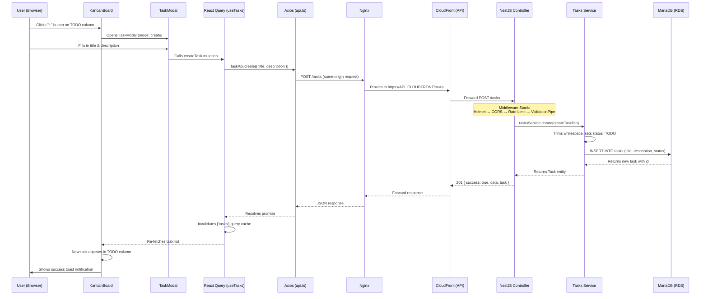

### 4.2 Update Task via Drag-and-Drop

When a user drags a task card from one column to another (e.g., TODO → IN_PROGRESS):

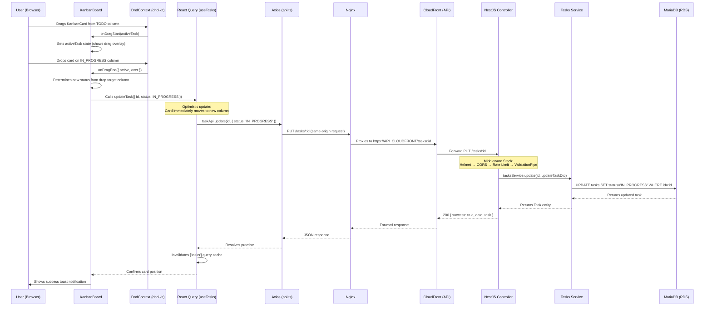

**Key detail:** The KanbanBoard uses `@dnd-kit`'s `PointerSensor` and `TouchSensor` so drag-and-drop works on both desktop and mobile devices. The `DndContext` wraps all three columns and manages the drag state.

---

## 5. AWS Production Architecture

The application is deployed across two AWS regions to optimise latency — the API sits close to the database in Singapore, while the frontend leverages CloudFront's US-based edge network.

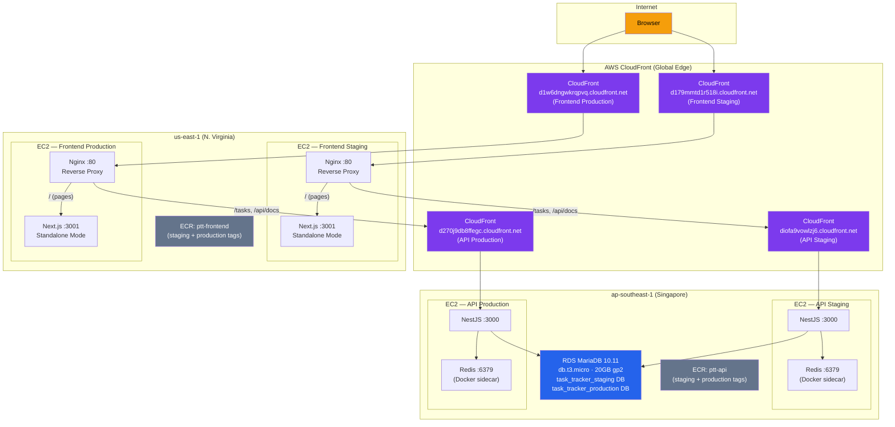

### How Requests Flow Through the Infrastructure

1. **User visits** `https://d1w6dngwkrqpvq.cloudfront.net` (production frontend)
2. **CloudFront** routes to the Frontend EC2 in us-east-1
3. **Nginx** on the EC2 serves the Next.js app for page requests (`/`)
4. **Browser JavaScript** makes API calls to the same origin (`/tasks`)
5. **Nginx** proxies `/tasks` and `/api/docs` to the API CloudFront (`d270j9db8ffegc.cloudfront.net`)
6. **API CloudFront** routes to the API EC2 in ap-southeast-1
7. **NestJS** processes the request and queries **RDS MariaDB** (same region = low latency)

### Why This Design?

- **API in ap-southeast-1**: Co-located with the database for minimal query latency
- **Frontend in us-east-1**: CloudFront edge optimisation is strongest from US regions
- **Same-origin API calls**: The browser talks to the frontend CloudFront URL for everything — Nginx handles the cross-region routing transparently. This avoids CORS complexity for the end user.

### CloudFront Configuration

| Distribution | Domain | Origin | Caching |
|---|---|---|---|
| Frontend Staging | `d179mmtd1r518i.cloudfront.net` | EC2 :80 (us-east-1) | Standard (static assets cached) |
| Frontend Production | `d1w6dngwkrqpvq.cloudfront.net` | EC2 :80 (us-east-1) | Standard |
| API Staging | `diofa9vowlzj6.cloudfront.net` | EC2 :3000 (ap-southeast-1) | **Disabled** — all HTTP methods forwarded |
| API Production | `d270j9db8ffegc.cloudfront.net` | EC2 :3000 (ap-southeast-1) | **Disabled** — all HTTP methods forwarded |

> **Important:** API CloudFront distributions have caching disabled and allow POST/PUT/DELETE methods to pass through. They act purely as a secure tunnel (HTTPS termination + IP hiding).

---

## 6. Deployment Pipeline

### 6.1 CI/CD Sequence

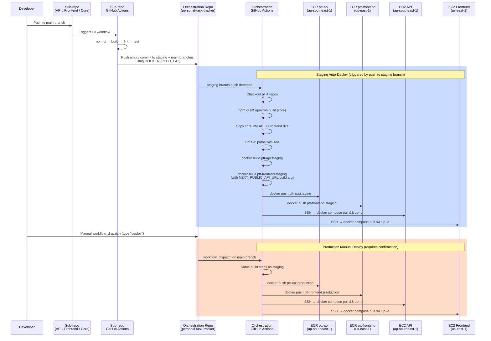

### 6.2 Build Steps in Detail

The CI/CD pipeline performs these steps in order:

```mermaid
graph LR
 A["1. Checkout<br/>All 4 repos"] --> B["2. Build Core<br/>npm ci + build"]
 B --> C["3. Copy Core<br/>into API + FE dirs"]
 C --> D["4. Fix Paths<br/>sed file: refs"]
 D --> E["5. ECR Login<br/>Both regions"]
 E --> F["6. Docker Build<br/>API image"]
 F --> G["7. Docker Build<br/>Frontend image"]
 G --> H["8. Push to ECR<br/>Both regions"]
 H --> I["9. SSH Deploy<br/>API EC2"]
 I --> J["10. SSH Deploy<br/>Frontend EC2"]

 style A fill:#6366f1,color:#fff
 style B fill:#6366f1,color:#fff
 style C fill:#6366f1,color:#fff
 style D fill:#6366f1,color:#fff
 style E fill:#f59e0b,color:#000
 style F fill:#ef4444,color:#fff
 style G fill:#ef4444,color:#fff
 style H fill:#ef4444,color:#fff
 style I fill:#10b981,color:#fff
 style J fill:#10b981,color:#fff
```

### 6.3 Triggers Summary

| Environment | Trigger | Branch | Confirmation |
|---|---|---|---|
| Staging | Automatic on push | `staging` | None — deploys immediately |
| Production | Manual `workflow_dispatch` | `main` | Must type `"deploy"` to confirm |

---

## 7. Security Layers

### 7.1 Application Security

```mermaid
graph LR
 REQ["Incoming<br/>HTTP Request"] --> HELMET["Helmet<br/>Security Headers"]
 HELMET --> CORS["CORS<br/>Origin Whitelist"]
 CORS --> RATE["Rate Limiting<br/>(3-tier)"]
 RATE --> VPIPE["ValidationPipe<br/>Input Sanitisation"]
 VPIPE --> CTRL["Controller<br/>Business Logic"]
 CTRL --> FILTER["AllExceptionsFilter<br/>Error Sanitisation"]
 FILTER --> LOG["LoggingInterceptor<br/>Request Audit"]
 LOG --> RES["HTTP Response"]

 style HELMET fill:#dc2626,color:#fff
 style CORS fill:#dc2626,color:#fff
 style RATE fill:#dc2626,color:#fff
 style VPIPE fill:#f59e0b,color:#000
 style FILTER fill:#f59e0b,color:#000
 style LOG fill:#64748b,color:#fff
```

**Middleware stack (executed in order):**

| Layer | What It Does |
|---|---|
| **Helmet** | Sets security HTTP headers (X-Frame-Options, X-Content-Type-Options, Strict-Transport-Security, etc.) |
| **CORS** | Only allows requests from the configured frontend CloudFront domain (`CORS_ORIGIN` env var) |
| **Rate Limiting** | Three tiers to prevent abuse — see table below |
| **ValidationPipe** | Validates and transforms request bodies using class-validator decorators on DTOs. Strips unknown fields (`whitelist: true`). |
| **AllExceptionsFilter** | Catches all uncaught exceptions and returns a standardised error response. Never leaks stack traces. |
| **LoggingInterceptor** | Logs every request: `METHOD URL STATUS DURATION IP USER_AGENT` |

**Rate limiting tiers:**

| Tier | Limit | Window | Purpose |
|---|---|---|---|
| Short | 10 requests | 1 second | Prevents burst attacks |
| Medium | 50 requests | 10 seconds | Prevents sustained abuse |
| Long | 100 requests | 60 seconds | Prevents slow-rate attacks |

### 7.2 Infrastructure Security

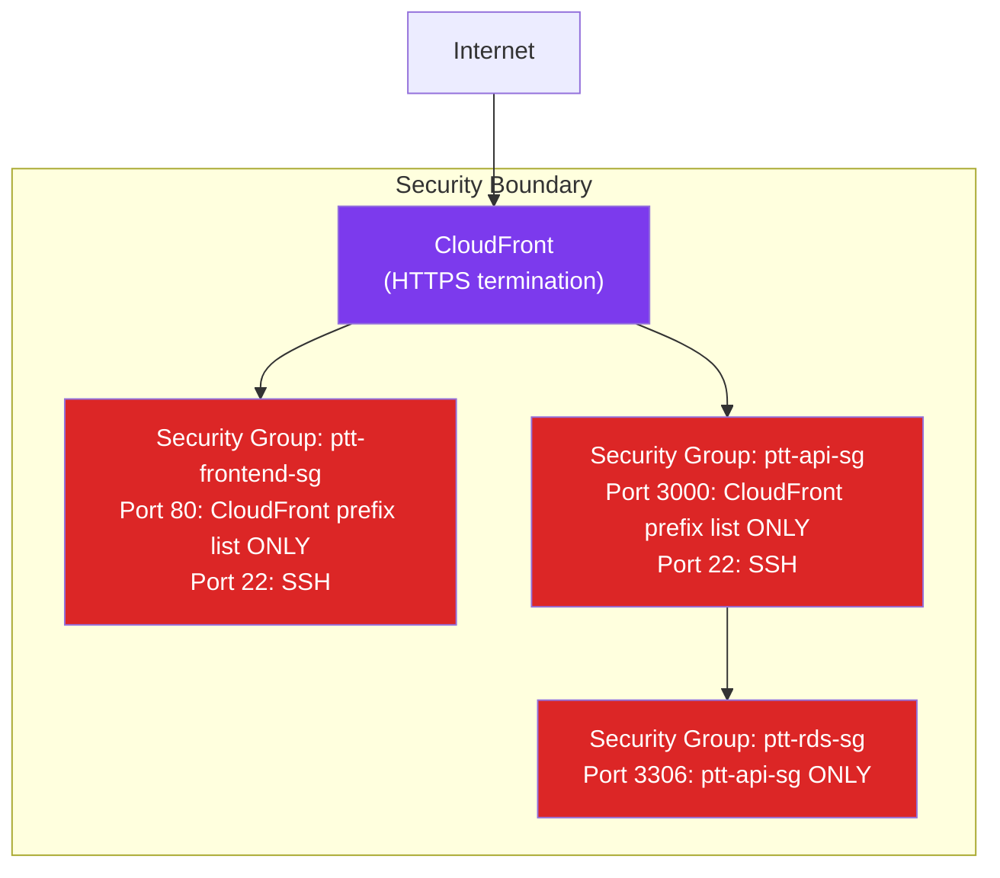

**Key infrastructure security measures:**

| Measure | Detail |
|---|---|
| **No public IP exposure** | EC2 instances are only reachable through CloudFront. Security groups use AWS-managed CloudFront prefix lists (`pl-31a34658` in ap-southeast-1, `pl-3b927c52` in us-east-1). |
| **HTTPS everywhere** | CloudFront terminates TLS. All browser ↔ CloudFront traffic is encrypted. Nginx ↔ API CloudFront proxy uses HTTPS with SNI. |
| **Database isolation** | RDS security group only allows inbound from the API security group — no direct internet access. |
| **Non-root containers** | Frontend Docker image runs as a dedicated `nextjs` user (not root). |
| **No secrets in code** | All credentials stored in GitHub Secrets and injected via environment variables at deploy time. |

---

## 8. Shared Dependency Model

The Core package is consumed differently in local development vs Docker builds:

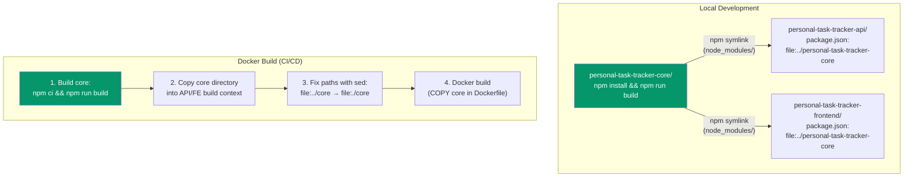

### Why `file:` Instead of a Published NPM Package?

- **Simplicity**: No need to manage an npm registry or versioning for a personal project.
- **Instant feedback**: Changes to Core are immediately available after `npm run build` — no publish/install cycle.
- **Docker workaround**: Docker can't follow symlinks outside the build context, so CI/CD physically copies the Core directory into each sub-repo before building.

### What Core Provides to Each Consumer

| Consumer | Uses From Core |
|---|---|
| **API** | `TaskStatus` enum (entity column type), `CreateTaskDTO`/`UpdateTaskDTO` (DTO validation), `ErrorCode`/`AppError` (exception filter), validation constants |
| **Frontend** | `TaskStatus` enum (column rendering), `Task` interface (type-safe API responses), `CreateTaskDTO`/`UpdateTaskDTO` (form data shapes), `ErrorCode`/`ERROR_MESSAGES` (user-friendly error display) |

---

## 9. Docker Architecture

### 9.1 Local Development Stack

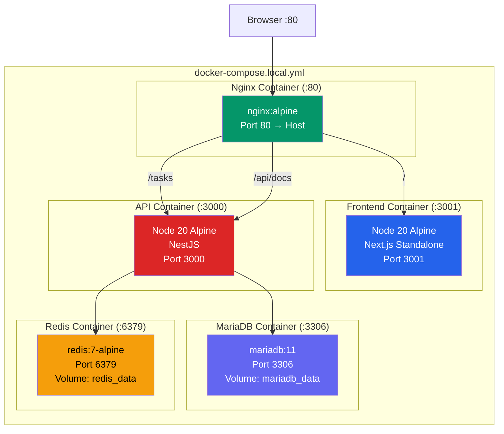

**Local development** uses a single `docker-compose.local.yml` that starts all 5 services. Nginx routes all traffic — you visit `http://localhost` and everything works.

### 9.2 Staging / Production Stack

In staging and production, the API and Frontend run on separate EC2 instances in different regions:

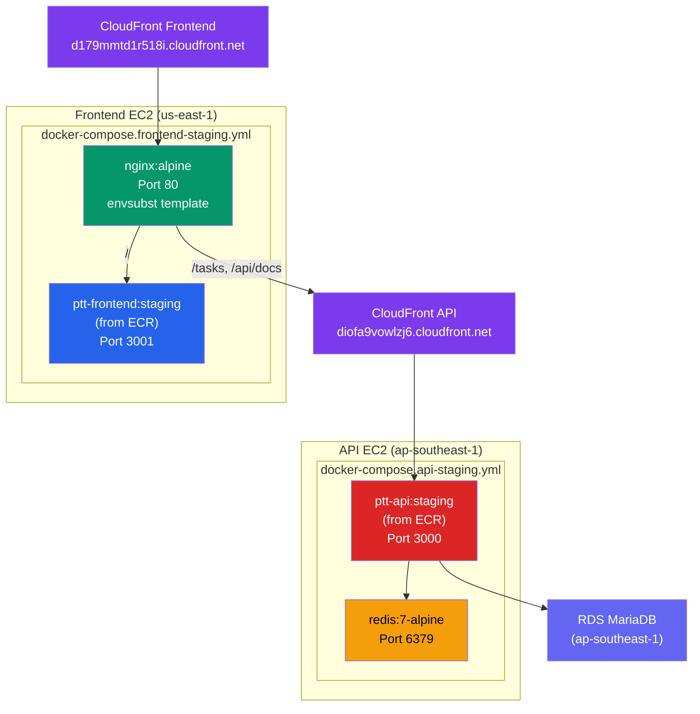

### 9.3 Multi-Stage Dockerfiles

Both the API and Frontend use multi-stage Docker builds to keep production images small:

**API Dockerfile:**

```
Stage 1 (builder): node:20-alpine → npm ci → npm run build → produces dist/
Stage 2 (production): node:20-alpine → copy dist/ → npm ci --omit=dev → EXPOSE 3000
```

**Frontend Dockerfile:**

```
Stage 1 (builder): node:20-alpine → npm ci → npm run build → produces .next/standalone
Stage 2 (production): node:20-alpine → copy .next/standalone + static + public → EXPOSE 3001
 Runs as non-root "nextjs" user
```

### 9.4 Nginx Configuration

**Local** (`nginx/default.conf`):
```nginx
upstream api { server api:3000; }
upstream frontend { server frontend:3001; }

server {
 listen 80;
 location /api/docs { proxy_pass http://api/api/docs; }
 location /tasks { proxy_pass http://api/tasks; }
 location / { proxy_pass http://frontend; }
}
```

**Staging/Production** (`nginx/default.conf.template`):
```nginx
upstream frontend { server frontend:3001; }

server {
 listen 80;
 # Cross-region proxy to API via CloudFront (HTTPS + SNI)
 location /api/docs {
 proxy_pass https://${API_HOST}/api/docs;
 proxy_set_header Host ${API_HOST};
 proxy_ssl_server_name on;
 }
 location /tasks {
 proxy_pass https://${API_HOST}/tasks;
 proxy_set_header Host ${API_HOST};
 proxy_ssl_server_name on;
 }
 location / { proxy_pass http://frontend; }
}
```

The `${API_HOST}` variable is replaced at container startup using Nginx's built-in `envsubst` support. For staging, `API_HOST=diofa9vowlzj6.cloudfront.net`; for production, `API_HOST=d270j9db8ffegc.cloudfront.net`.

---

## 10. Error Handling Flow

When something goes wrong, the error system ensures the user always sees a meaningful message — never a raw stack trace or cryptic database error.

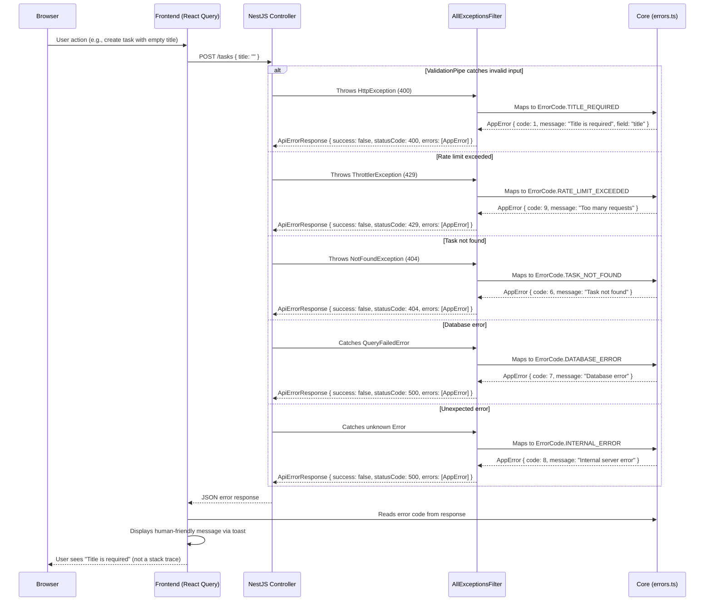

### Standard Error Response Format

Every API error follows this shape:

```json
{
 "success": false,
 "statusCode": 400,
 "errors": [
 {
 "code": 1,
 "message": "Title is required",
 "field": "title"
 }
 ]
}
```

### Error Code Quick Reference

| Code | Name | HTTP Status | When It Happens |
|---|---|---|---|
| 0 | `VALIDATION_FAILED` | 400 | Generic validation error |
| 1 | `TITLE_REQUIRED` | 400 | Task created/updated without a title |
| 2 | `TITLE_TOO_LONG` | 400 | Title exceeds 255 characters |
| 3 | `DESCRIPTION_TOO_LONG` | 400 | Description exceeds 1000 characters |
| 4 | `INVALID_STATUS` | 400 | Status is not TODO, IN_PROGRESS, or DONE |
| 5 | `UNKNOWN_FIELDS` | 400 | Request body contains unrecognised fields |
| 6 | `TASK_NOT_FOUND` | 404 | No task with the given ID exists |
| 7 | `DATABASE_ERROR` | 500 | Database query failed |
| 8 | `INTERNAL_ERROR` | 500 | Unexpected server error |
| 9 | `RATE_LIMIT_EXCEEDED` | 429 | Too many requests |
| 10 | `SERVICE_UNAVAILABLE` | 503 | Service is down or unreachable |

---

## 11. API Endpoints Reference

Base URL: `/tasks` (proxied through Nginx in all environments)

| Method | Endpoint | Description | Request Body | Response |
|---|---|---|---|---|
| `GET` | `/tasks` | List all tasks | — | `{ success: true, data: Task[] }` |
| `GET` | `/tasks?status=TODO` | Filter tasks by status | — | `{ success: true, data: Task[] }` |
| `GET` | `/tasks/:id` | Get a single task | — | `{ success: true, data: Task }` |
| `POST` | `/tasks` | Create a new task | `{ title: string, description?: string }` | `{ success: true, data: Task }` (201) |
| `PUT` | `/tasks/:id` | Update a task | `{ title?, description?, status? }` | `{ success: true, data: Task }` |
| `DELETE` | `/tasks/:id` | Delete a task | — | `{ success: true, data: null }` |

### Swagger Documentation

Interactive API docs are available at:

| Environment | URL |
|---|---|
| Local | http://localhost:3000/api/docs |
| Staging | https://diofa9vowlzj6.cloudfront.net/api/docs |
| Production | https://d270j9db8ffegc.cloudfront.net/api/docs |

### Task Entity

| Field | Type | Constraints |
|---|---|---|
| `id` | `number` | Auto-increment primary key |
| `title` | `string` | Required, max 255 characters |
| `description` | `string \| null` | Optional, max 1000 characters |
| `status` | `TaskStatus` | Enum: `TODO`, `IN_PROGRESS`, `DONE` (default: `TODO`) |
| `created_at` | `Date` | Auto-generated timestamp |

---

## 12. Environment Configuration

### 12.1 Local Development (`.env.local.example`)

```env
DB_ROOT_PASSWORD=password
DB_USERNAME=taskuser
DB_PASSWORD=taskpassword
DB_DATABASE=task_tracker
```

### 12.2 API Staging/Production (`.env.api.example`)

```env
AWS_ACCOUNT_ID=623756711231
DB_HOST=<your-rds-endpoint>.rds.amazonaws.com
DB_USERNAME=taskuser
DB_PASSWORD=<secure-password>
DB_DATABASE=task_tracker_staging # or task_tracker_production
CORS_ORIGIN=https://d179mmtd1r518i.cloudfront.net # frontend CloudFront domain
```

### 12.3 Frontend Staging/Production (`.env.frontend.example`)

```env
AWS_ACCOUNT_ID=623756711231
NEXT_PUBLIC_API_URL=https://d179mmtd1r518i.cloudfront.net # same as frontend CloudFront
API_HOST=diofa9vowlzj6.cloudfront.net # API CloudFront (for Nginx proxy)
```

### Environment Variable Reference

| Variable | Used By | Purpose |
|---|---|---|
| `NODE_ENV` | API | `development`, `staging`, or `production` |
| `PORT` | API | API server port (default: `3000`) |
| `DB_HOST` | API | RDS MariaDB endpoint |
| `DB_PORT` | API | MariaDB port (default: `3306`) |
| `DB_USERNAME` | API | Database user |
| `DB_PASSWORD` | API | Database password |
| `DB_DATABASE` | API | Database name (`task_tracker_staging` or `task_tracker_production`) |
| `REDIS_HOST` | API | Redis hostname (default: `redis` in Docker) |
| `REDIS_PORT` | API | Redis port (default: `6379`) |
| `REDIS_TTL` | API | Cache TTL in seconds (default: `60`) |
| `CORS_ORIGIN` | API | Allowed CORS origin (frontend CloudFront URL) |
| `NEXT_PUBLIC_API_URL` | Frontend | API base URL baked into the build (frontend CloudFront URL for same-origin) |
| `API_HOST` | Nginx | API CloudFront domain for cross-region proxy |
| `AWS_ACCOUNT_ID` | CI/CD | AWS account for ECR image paths |

### GitHub Actions Secrets

| Secret | Purpose |
|---|---|
| `AWS_ACCESS_KEY_ID` | IAM credentials for ECR push and EC2 deploy |
| `AWS_SECRET_ACCESS_KEY` | IAM credentials |
| `AWS_ACCOUNT_ID` | 12-digit AWS account ID |
| `STAGING_API_EC2_HOST` | Staging API EC2 elastic IP |
| `STAGING_FRONTEND_EC2_HOST` | Staging Frontend EC2 elastic IP |
| `STAGING_EC2_SSH_KEY` | SSH private key for staging EC2 instances |
| `STAGING_API_URL` | Staging frontend CloudFront URL (baked into build) |
| `PRODUCTION_API_EC2_HOST` | Production API EC2 elastic IP |
| `PRODUCTION_FRONTEND_EC2_HOST` | Production Frontend EC2 elastic IP |
| `PRODUCTION_EC2_SSH_KEY` | SSH private key for production EC2 instances |
| `PRODUCTION_API_URL` | Production frontend CloudFront URL (baked into build) |
| `DOCKER_REPO_PAT` | GitHub PAT for sub-repos to push to orchestration repo |

---

## Testing Overview

All three code repositories have comprehensive test suites:

| Repository | Tests | What's Tested |
|---|---|---|
| **Core** | 42 | Error codes, validation functions, constants, type exports |
| **API** | 84 (74 unit + 10 integration) | Controller endpoints, service logic, exception filters, interceptors, DTOs |
| **Frontend** | 52 | API client, React Query hooks, KanbanCard, KanbanColumn, KanbanSkeleton, TaskModal, DeleteConfirmModal |
| **Total** | **178** | Full-stack coverage |

Run tests in any repo:

```bash
npm test # Run all tests
npm run test:cov # Run with coverage report
```
