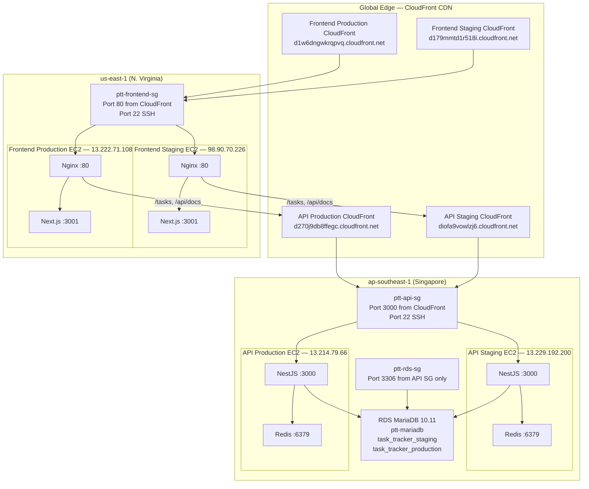
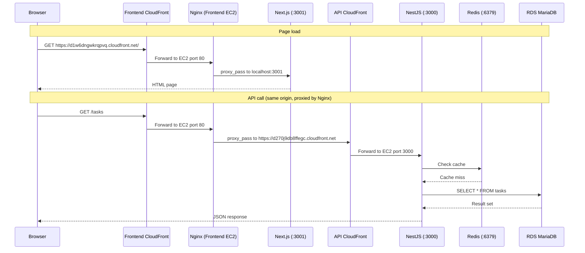
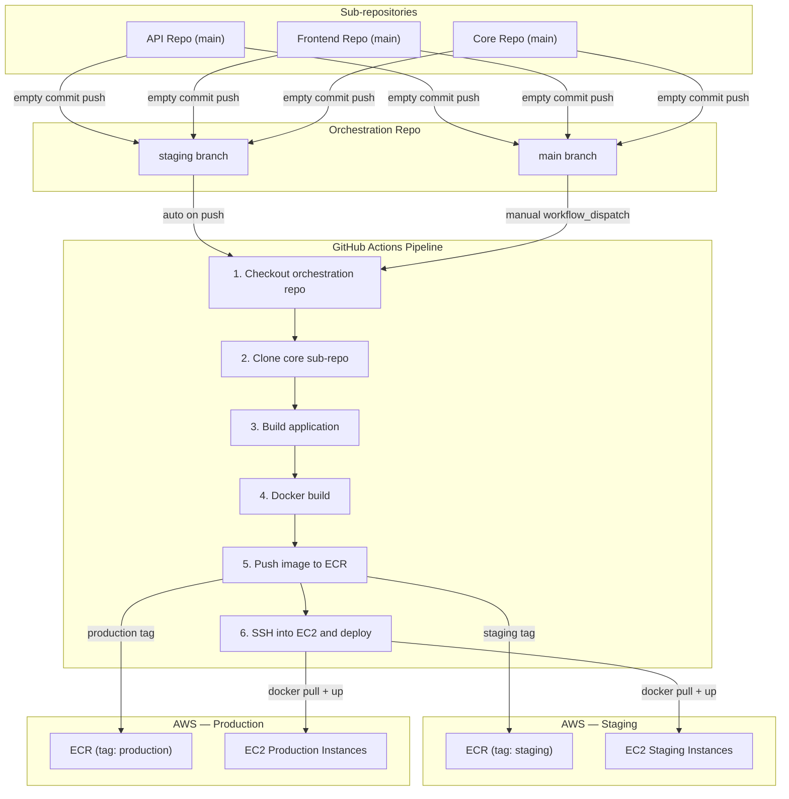

# AWS Infrastructure Setup Guide

This guide walks through every AWS resource used by Personal Task Tracker, how the
pieces fit together, and how to recreate the infrastructure from scratch. The project
runs across two AWS regions with CloudFront providing HTTPS and edge caching in front
of all services.

---

## Table of Contents

1. [Architecture Overview](#architecture-overview)
2. [Request Flow](#request-flow)
3. [AWS Resources](#aws-resources)
4. [Security](#security)
5. [Step-by-Step Setup](#step-by-step-setup)
6. [GitHub Secrets](#github-secrets)
7. [CI/CD Flow](#cicd-flow)
8. [Deployment Commands](#deployment-commands)
9. [Troubleshooting](#troubleshooting)
10. [Cost Estimate](#cost-estimate)

---

## Architecture Overview

The API and database run in **ap-southeast-1** (Singapore) to keep database latency
low. The frontend runs in **us-east-1** (N. Virginia) because CloudFront distributions
are managed from that region. Every request enters through CloudFront so that EC2
instances are never directly exposed to the internet.



---

## Request Flow

When a user opens the application in a browser, two types of request happen. The
first loads the page itself. The second fetches task data from the API. Both go
through CloudFront, but the API request takes an extra hop through Nginx on the
frontend EC2 so that browser same-origin restrictions are satisfied.



---

## AWS Resources

### Compute

| Resource | Region | Instance Type | Elastic IP | AMI |
|---|---|---|---|---|
| API Staging EC2 | ap-southeast-1 | t3.micro | 13.229.192.200 | Amazon Linux 2023 |
| API Production EC2 | ap-southeast-1 | t3.micro | 13.214.79.66 | Amazon Linux 2023 |
| Frontend Staging EC2 | us-east-1 | t3.micro | 98.90.70.226 | Amazon Linux 2023 |
| Frontend Production EC2 | us-east-1 | t3.micro | 13.222.71.108 | Amazon Linux 2023 |

All EC2 instances use the `personal-task-tracker-deploy` key pair for SSH access.
Docker and Docker Compose are installed on every instance. The AWS CLI is configured
on each instance so that `docker login` to ECR works during deployment.

### CloudFront

| Environment | Distribution ID | Domain | Origin | Cache Behaviour |
|---|---|---|---|---|
| API Staging | E1ZNNY4LBTHMIF | diofa9vowlzj6.cloudfront.net | API Staging EC2 :3000 | Caching disabled, all HTTP methods |
| API Production | E1H0JVZQI5FCZG | d270j9db8ffegc.cloudfront.net | API Production EC2 :3000 | Caching disabled, all HTTP methods |
| Frontend Staging | E1NQFJER93057G | d179mmtd1r518i.cloudfront.net | Frontend Staging EC2 :80 | Standard caching, GET/HEAD only |
| Frontend Production | EEFTGCVP1R1HH | d1w6dngwkrqpvq.cloudfront.net | Frontend Production EC2 :80 | Standard caching, GET/HEAD only |

> **Note:** CloudFront origins must be set to the EC2 **public DNS name**, not the
> Elastic IP. For ap-southeast-1 the format is
> `ec2-13-229-192-200.ap-southeast-1.compute.amazonaws.com`. For us-east-1 the format
> is `ec2-98-90-70-226.compute-1.amazonaws.com`. If you use the IP address directly,
> CloudFront will return 502 errors.

### Database

| Resource | Region | Details |
|---|---|---|
| RDS Instance | ap-southeast-1 | MariaDB 10.11, db.t3.micro, 20 GB gp2 storage |
| Endpoint | ap-southeast-1 | ptt-mariadb.cxgaqi0mg6kr.ap-southeast-1.rds.amazonaws.com |
| Staging Database | ap-southeast-1 | task_tracker_staging |
| Production Database | ap-southeast-1 | task_tracker_production |
| Application User | ap-southeast-1 | taskuser (full privileges on both databases) |

Redis runs locally on each API EC2 instance (port 6379). There is no managed
ElastiCache cluster.

### Security Groups

| Name | Region | Inbound Rules |
|---|---|---|
| ptt-api-sg | ap-southeast-1 | TCP 3000 from CloudFront prefix list `pl-31a34658`, TCP 22 from 0.0.0.0/0 |
| ptt-frontend-sg | us-east-1 | TCP 80 from CloudFront prefix list `pl-3b927c52`, TCP 22 from 0.0.0.0/0 |
| ptt-rds-sg | ap-southeast-1 | TCP 3306 from ptt-api-sg only |

### Container Registry

| Repository | Region | Purpose |
|---|---|---|
| ptt-api | ap-southeast-1 | API Docker images (tags: staging, production) |
| ptt-frontend | us-east-1 | Frontend Docker images (tags: staging, production) |

---

## Security

### Application Layer

| Layer | Mechanism | Description |
|---|---|---|
| HTTPS termination | CloudFront | All traffic is encrypted between the browser and CloudFront |
| CORS | NestJS middleware | Only the frontend CloudFront domain is allowed as an origin |
| API proxy | Nginx reverse proxy | The browser never contacts the API directly; Nginx forwards /tasks and /api/docs to the API CloudFront over HTTPS |
| Database credentials | EC2 environment files | Stored in .env on each API EC2 instance, never committed to source control |
| Build-time variables | NEXT_PUBLIC_API_URL | Baked into the Next.js build so the browser requests the same CloudFront origin and Nginx handles proxying |

### Infrastructure Layer

| Layer | Mechanism | Description |
|---|---|---|
| EC2 network isolation | CloudFront managed prefix lists | Port 3000 (API) and port 80 (Frontend) accept traffic only from CloudFront edge IPs, blocking direct access |
| Database network isolation | Security group chaining | Port 3306 on RDS accepts connections only from the ptt-api-sg security group |
| SSH access | Key pair authentication | All instances use the personal-task-tracker-deploy key pair; password authentication is disabled |
| IAM | Least-privilege access key | The deploy IAM user has permissions limited to ECR push/pull and EC2 describe |
| Secrets management | GitHub Actions encrypted secrets | AWS credentials and SSH keys are stored as repository secrets, never exposed in logs |

---

## Step-by-Step Setup

### Prerequisites

| Tool | Version | How to check | How to install |
|---|---|---|---|
| AWS CLI | 2.x | `aws --version` | [AWS CLI install guide](https://docs.aws.amazon.com/cli/latest/userguide/getting-started-install.html) |
| Docker | 20.x or later | `docker --version` | [Docker install guide](https://docs.docker.com/get-docker/) |
| SSH client | any | `ssh -V` | Included with macOS and most Linux distributions |

Make sure you have configured the AWS CLI with credentials that have permission to
create EC2, RDS, ECR, and CloudFront resources:

```bash
# This will prompt for your Access Key ID, Secret Access Key, and default region.
# Set the default region to ap-southeast-1 since most resources live there.
aws configure
```

You should see output similar to:

```
AWS Access Key ID [None]: AKIA...
AWS Secret Access Key [None]: ****
Default region name [None]: ap-southeast-1
Default output format [None]: json
```

---

### Step 1 -- Create the EC2 Key Pair

The key pair lets you SSH into every EC2 instance. Create it once and reuse it
across both regions.

```bash
# Generate the key pair and save the private key to a local file.
# The --query flag extracts just the key material from the JSON response.
aws ec2 create-key-pair \
  --key-name personal-task-tracker-deploy \
  --query 'KeyMaterial' \
  --output text > personal-task-tracker-deploy.pem

# Restrict file permissions so only you can read it.
# SSH will refuse to use the key if permissions are too open.
chmod 400 personal-task-tracker-deploy.pem
```

You should see the file created with no errors:

```
$ ls -la personal-task-tracker-deploy.pem
-r--------  1 user  staff  1674 ... personal-task-tracker-deploy.pem
```

Now import the same key into us-east-1 so frontend instances can use it too:

```bash
# Import the public portion of the key into the second region.
aws ec2 import-key-pair \
  --key-name personal-task-tracker-deploy \
  --public-key-material fileb://~/.ssh/personal-task-tracker-deploy.pub \
  --region us-east-1
```

> **Note:** Keep `personal-task-tracker-deploy.pem` in a safe location. You will need
> it every time you SSH into an instance, and it cannot be downloaded again from AWS.

---

### Step 2 -- Create Security Groups

Security groups act as firewalls for your instances. Each group defines which
ports are open and where traffic is allowed to come from.

**API security group (ap-southeast-1):**

```bash
# Create the security group inside your default VPC.
# Save the returned GroupId -- you will need it for the next commands.
aws ec2 create-security-group \
  --group-name ptt-api-sg \
  --description "Personal Task Tracker API" \
  --region ap-southeast-1
```

You should see:

```json
{
    "GroupId": "sg-0abc1234def56789a"
}
```

```bash
# Allow SSH from anywhere so you can connect for administration.
aws ec2 authorize-security-group-ingress \
  --group-id <api-sg-id> \
  --protocol tcp \
  --port 22 \
  --cidr 0.0.0.0/0 \
  --region ap-southeast-1

# Allow port 3000 ONLY from CloudFront edge servers.
# pl-31a34658 is the AWS-managed prefix list for CloudFront in ap-southeast-1.
# This means no one can reach port 3000 by hitting the EC2 IP directly.
aws ec2 authorize-security-group-ingress \
  --group-id <api-sg-id> \
  --ip-permissions "IpProtocol=tcp,FromPort=3000,ToPort=3000,PrefixListIds=[{PrefixListId=pl-31a34658}]" \
  --region ap-southeast-1
```

**Frontend security group (us-east-1):**

```bash
# Create the frontend security group in the N. Virginia region.
aws ec2 create-security-group \
  --group-name ptt-frontend-sg \
  --description "Personal Task Tracker Frontend" \
  --region us-east-1

# Allow SSH.
aws ec2 authorize-security-group-ingress \
  --group-id <frontend-sg-id> \
  --protocol tcp \
  --port 22 \
  --cidr 0.0.0.0/0 \
  --region us-east-1

# Allow port 80 ONLY from CloudFront edge servers.
# pl-3b927c52 is the AWS-managed prefix list for CloudFront in us-east-1.
aws ec2 authorize-security-group-ingress \
  --group-id <frontend-sg-id> \
  --ip-permissions "IpProtocol=tcp,FromPort=80,ToPort=80,PrefixListIds=[{PrefixListId=pl-3b927c52}]" \
  --region us-east-1
```

**RDS security group (ap-southeast-1):**

```bash
# Create a security group for the database.
aws ec2 create-security-group \
  --group-name ptt-rds-sg \
  --description "Personal Task Tracker RDS" \
  --region ap-southeast-1

# Allow MariaDB connections ONLY from the API security group.
# This ensures only the API EC2 instances can reach the database.
aws ec2 authorize-security-group-ingress \
  --group-id <rds-sg-id> \
  --protocol tcp \
  --port 3306 \
  --source-group <api-sg-id> \
  --region ap-southeast-1
```

> **Tip:** You can look up the CloudFront prefix list for any region with:
> ```bash
> aws ec2 describe-managed-prefix-lists \
>   --filters "Name=prefix-list-name,Values=com.amazonaws.global.cloudfront.origin-facing" \
>   --region ap-southeast-1 \
>   --query "PrefixLists[0].PrefixListId" \
>   --output text
> ```

---

### Step 3 -- Create the RDS MariaDB Instance

The database is shared between staging and production using separate database
names on the same instance to stay within the free tier.

```bash
# Create a MariaDB 10.11 instance.
# --no-publicly-accessible keeps it inside the VPC.
# --backup-retention-period 7 enables automated daily backups for one week.
aws rds create-db-instance \
  --db-instance-identifier ptt-mariadb \
  --db-instance-class db.t3.micro \
  --engine mariadb \
  --engine-version "10.11" \
  --master-username admin \
  --master-user-password '<your-secure-password>' \
  --allocated-storage 20 \
  --storage-type gp2 \
  --vpc-security-group-ids <rds-sg-id> \
  --no-publicly-accessible \
  --backup-retention-period 7 \
  --no-multi-az \
  --region ap-southeast-1
```

Wait for the instance to become available. This usually takes 5 to 10 minutes:

```bash
# Poll the instance status until it shows "available".
aws rds wait db-instance-available \
  --db-instance-identifier ptt-mariadb \
  --region ap-southeast-1
```

You should see the command return with no output, meaning the instance is ready.

Now connect from an API EC2 instance to create the databases and application user:

```bash
# SSH into the API staging EC2.
ssh -i personal-task-tracker-deploy.pem ec2-user@13.229.192.200

# Install the MariaDB client so you can connect to RDS.
sudo yum install -y mariadb105

# Connect to RDS using the admin credentials.
mysql -h ptt-mariadb.cxgaqi0mg6kr.ap-southeast-1.rds.amazonaws.com \
  -u admin -p
```

Run these SQL statements to create the two databases and the application user:

```sql
-- Create a database for each environment.
CREATE DATABASE task_tracker_staging;
CREATE DATABASE task_tracker_production;

-- Create the application user.
-- Replace <secure-password> with a strong password.
CREATE USER 'taskuser'@'%' IDENTIFIED BY '<secure-password>';

-- Grant full privileges on both databases.
GRANT ALL PRIVILEGES ON task_tracker_staging.* TO 'taskuser'@'%';
GRANT ALL PRIVILEGES ON task_tracker_production.* TO 'taskuser'@'%';

-- Apply the privilege changes.
FLUSH PRIVILEGES;
```

You should see `Query OK` after each statement.

---

### Step 4 -- Create ECR Repositories

ECR (Elastic Container Registry) stores the Docker images that get deployed to EC2.
Each repository lives in the same region as the EC2 instances that pull from it.

```bash
# Create the API repository in Singapore.
aws ecr create-repository \
  --repository-name ptt-api \
  --region ap-southeast-1

# Create the frontend repository in N. Virginia.
aws ecr create-repository \
  --repository-name ptt-frontend \
  --region us-east-1
```

You should see JSON output with the `repositoryUri` for each:

```
<account-id>.dkr.ecr.ap-southeast-1.amazonaws.com/ptt-api
<account-id>.dkr.ecr.us-east-1.amazonaws.com/ptt-frontend
```

---

### Step 5 -- Launch EC2 Instances

Launch four instances: one API and one frontend for each environment. Amazon Linux
2023 is used for all instances.

```bash
# Look up the latest Amazon Linux 2023 AMI in each region.
# This returns the AMI ID you will use in the run-instances command.
aws ssm get-parameters-by-path \
  --path /aws/service/ami-amazon-linux-latest \
  --query "Parameters[?Name=='/aws/service/ami-amazon-linux-latest/al2023-ami-kernel-default-x86_64'].Value" \
  --output text \
  --region ap-southeast-1
```

**Launch the API staging instance:**

```bash
aws ec2 run-instances \
  --image-id <ami-id> \
  --instance-type t3.micro \
  --key-name personal-task-tracker-deploy \
  --security-group-ids <api-sg-id> \
  --tag-specifications 'ResourceType=instance,Tags=[{Key=Name,Value=ptt-api-staging}]' \
  --region ap-southeast-1
```

Repeat for `ptt-api-production` (ap-southeast-1), `ptt-frontend-staging` (us-east-1),
and `ptt-frontend-production` (us-east-1), adjusting the security group and region
each time.

**Allocate and associate Elastic IPs:**

```bash
# Allocate a static IP address.
aws ec2 allocate-address --domain vpc --region ap-southeast-1

# Associate it with the instance.
# Replace <instance-id> and <eip-alloc-id> with the values from the previous commands.
aws ec2 associate-address \
  --instance-id <instance-id> \
  --allocation-id <eip-alloc-id> \
  --region ap-southeast-1
```

Repeat for all four instances. The final Elastic IP assignments are:

| Instance | Elastic IP |
|---|---|
| ptt-api-staging | 13.229.192.200 |
| ptt-api-production | 13.214.79.66 |
| ptt-frontend-staging | 98.90.70.226 |
| ptt-frontend-production | 13.222.71.108 |

**Install Docker on each instance:**

SSH into each instance and run:

```bash
# Update the system packages.
sudo yum update -y

# Install Docker.
sudo yum install -y docker

# Start Docker and enable it on boot.
sudo systemctl enable docker && sudo systemctl start docker

# Add ec2-user to the docker group so you can run docker without sudo.
sudo usermod -aG docker ec2-user

# Install Docker Compose.
sudo curl -L \
  "https://github.com/docker/compose/releases/latest/download/docker-compose-$(uname -s)-$(uname -m)" \
  -o /usr/local/bin/docker-compose
sudo chmod +x /usr/local/bin/docker-compose
sudo ln -sf /usr/local/bin/docker-compose /usr/bin/docker-compose
```

You should see Docker running:

```bash
docker --version
# Docker version 25.x.x, build ...

docker-compose --version
# Docker Compose version v2.x.x
```

**Configure AWS CLI on each instance for ECR login:**

```bash
# Configure with the deploy IAM user credentials.
aws configure
```

---

### Step 6 -- Create CloudFront Distributions

CloudFront provides HTTPS termination and protects EC2 instances from direct access.
The API distributions disable caching and allow all HTTP methods. The frontend
distributions use standard caching and only allow GET/HEAD.

**API CloudFront (caching disabled):**

```bash
# Use the CachingDisabled managed policy and AllViewer origin request policy.
# This passes all headers, query strings, and cookies to the origin untouched.
aws cloudfront create-distribution \
  --origin-domain-name ec2-13-229-192-200.ap-southeast-1.compute.amazonaws.com \
  --default-cache-behavior '{
    "TargetOriginId": "ptt-api-staging",
    "ViewerProtocolPolicy": "redirect-to-https",
    "AllowedMethods": {
      "Quantity": 7,
      "Items": ["GET","HEAD","OPTIONS","PUT","PATCH","POST","DELETE"],
      "CachedMethods": {"Quantity": 2, "Items": ["GET","HEAD"]}
    },
    "CachePolicyId": "4135ea2d-6df8-44a3-9df3-4b5a84be39ad",
    "OriginRequestPolicyId": "216adef6-5c7f-47e4-b989-5492eafa07d3",
    "Compress": true
  }'
```

Repeat for the production API instance using the production EC2 public DNS.

**Frontend CloudFront (standard caching):**

```bash
# Use the CachingOptimized managed policy.
# Only GET and HEAD requests are allowed since the frontend serves static assets.
aws cloudfront create-distribution \
  --origin-domain-name ec2-98-90-70-226.compute-1.amazonaws.com \
  --default-cache-behavior '{
    "TargetOriginId": "ptt-frontend-staging",
    "ViewerProtocolPolicy": "redirect-to-https",
    "AllowedMethods": {
      "Quantity": 2,
      "Items": ["GET","HEAD"],
      "CachedMethods": {"Quantity": 2, "Items": ["GET","HEAD"]}
    },
    "CachePolicyId": "658327ea-f89d-4fab-a63d-7e88639e58f6",
    "Compress": true
  }'
```

Repeat for the production frontend instance.

> **Note:** It takes 5 to 15 minutes for a new CloudFront distribution to deploy
> globally. You can check the status with:
> ```bash
> aws cloudfront get-distribution --id E1ZNNY4LBTHMIF \
>   --query "Distribution.Status" --output text
> ```
> You should see `Deployed` when it is ready.

The final distribution assignments are:

| Distribution | ID | Domain |
|---|---|---|
| API Staging | E1ZNNY4LBTHMIF | diofa9vowlzj6.cloudfront.net |
| API Production | E1H0JVZQI5FCZG | d270j9db8ffegc.cloudfront.net |
| Frontend Staging | E1NQFJER93057G | d179mmtd1r518i.cloudfront.net |
| Frontend Production | EEFTGCVP1R1HH | d1w6dngwkrqpvq.cloudfront.net |

---

### Step 7 -- Configure EC2 Environment Files

Each EC2 instance needs a `.env` file that Docker Compose reads at startup. SSH into
each instance and create the file.

**API EC2 instances** (`/home/ec2-user/personal-task-tracker/.env`):

```bash
ssh -i personal-task-tracker-deploy.pem ec2-user@13.229.192.200

mkdir -p /home/ec2-user/personal-task-tracker
cat > /home/ec2-user/personal-task-tracker/.env << 'EOF'
AWS_ACCOUNT_ID=<your-account-id>
DB_HOST=ptt-mariadb.cxgaqi0mg6kr.ap-southeast-1.rds.amazonaws.com
DB_USERNAME=taskuser
DB_PASSWORD=<secure-password>
DB_DATABASE=task_tracker_staging
CORS_ORIGIN=https://d179mmtd1r518i.cloudfront.net
EOF
```

For the production API EC2 (13.214.79.66), change `DB_DATABASE` to
`task_tracker_production` and `CORS_ORIGIN` to
`https://d1w6dngwkrqpvq.cloudfront.net`.

**Frontend EC2 instances** (`/home/ec2-user/personal-task-tracker/.env`):

```bash
ssh -i personal-task-tracker-deploy.pem ec2-user@98.90.70.226

mkdir -p /home/ec2-user/personal-task-tracker
cat > /home/ec2-user/personal-task-tracker/.env << 'EOF'
AWS_ACCOUNT_ID=<your-account-id>
NEXT_PUBLIC_API_URL=https://d179mmtd1r518i.cloudfront.net
API_HOST=diofa9vowlzj6.cloudfront.net
EOF
```

For the production frontend EC2 (13.222.71.108), set `NEXT_PUBLIC_API_URL` to
`https://d1w6dngwkrqpvq.cloudfront.net` and `API_HOST` to
`d270j9db8ffegc.cloudfront.net`.

> **Note:** `NEXT_PUBLIC_API_URL` is the **frontend** CloudFront domain, not the API
> CloudFront domain. The browser makes requests to the same origin it loaded the page
> from, and Nginx proxies `/tasks` and `/api/docs` to the API CloudFront. This
> variable is baked into the Next.js build at build time and cannot be changed at
> runtime.

> **Note:** `API_HOST` is the API CloudFront domain. Nginx uses this value in its
> `proxy_pass` directive via `envsubst` to forward API requests.

---

### Step 8 -- Install Redis on API EC2 Instances

Redis is used for caching on the API side. It runs directly on the EC2 instance
rather than as a managed ElastiCache cluster to keep costs within the free tier.

SSH into each API EC2 instance and run:

```bash
# Install Redis.
sudo yum install -y redis6

# Start Redis and enable it on boot.
sudo systemctl enable redis6 && sudo systemctl start redis6

# Verify Redis is running.
redis6-cli ping
```

You should see:

```
PONG
```

Repeat on the production API instance (13.214.79.66).

---

### Step 9 -- Set Up Nginx on Frontend EC2 Instances

Nginx runs on each frontend EC2 instance and does three things: it serves the
Next.js application, proxies `/tasks` to the API CloudFront, and proxies `/api/docs`
to the API CloudFront. The configuration uses an `envsubst` template so the API
host can be set via the `.env` file.

SSH into each frontend EC2 instance and install Nginx:

```bash
# Install Nginx.
sudo yum install -y nginx

# Enable Nginx on boot.
sudo systemctl enable nginx
```

Create the Nginx configuration template:

```bash
sudo cat > /etc/nginx/conf.d/personal-task-tracker.conf.template << 'TEMPLATE'
server {
    listen 80;
    server_name _;

    # Serve the Next.js application.
    location / {
        proxy_pass http://localhost:3001;
        proxy_http_version 1.1;
        proxy_set_header Upgrade $http_upgrade;
        proxy_set_header Connection 'upgrade';
        proxy_set_header Host $host;
        proxy_cache_bypass $http_upgrade;
    }

    # Proxy API task requests to the API CloudFront distribution.
    location /tasks {
        proxy_pass https://${API_HOST}/tasks;
        proxy_http_version 1.1;
        proxy_set_header Host ${API_HOST};
        proxy_set_header X-Real-IP $remote_addr;
        proxy_set_header X-Forwarded-For $proxy_add_x_forwarded_for;
        proxy_set_header X-Forwarded-Proto $scheme;
        # Required for HTTPS proxy_pass to a CloudFront domain.
        proxy_ssl_server_name on;
    }

    # Proxy Swagger docs to the API CloudFront distribution.
    location /api/docs {
        proxy_pass https://${API_HOST}/api/docs;
        proxy_http_version 1.1;
        proxy_set_header Host ${API_HOST};
        proxy_set_header X-Real-IP $remote_addr;
        proxy_set_header X-Forwarded-For $proxy_add_x_forwarded_for;
        proxy_set_header X-Forwarded-Proto $scheme;
        proxy_ssl_server_name on;
    }
}
TEMPLATE
```

Generate the final configuration from the template and start Nginx:

```bash
# Read API_HOST from the .env file and substitute it into the template.
export API_HOST=$(grep API_HOST /home/ec2-user/personal-task-tracker/.env | cut -d= -f2)

envsubst '${API_HOST}' \
  < /etc/nginx/conf.d/personal-task-tracker.conf.template \
  | sudo tee /etc/nginx/conf.d/personal-task-tracker.conf > /dev/null

# Remove the default server block to avoid conflicts.
sudo rm -f /etc/nginx/conf.d/default.conf

# Test the configuration.
sudo nginx -t

# Start Nginx.
sudo systemctl start nginx
```

You should see:

```
nginx: the configuration file /etc/nginx/nginx.conf syntax is ok
nginx: configuration file /etc/nginx/nginx.conf test is successful
```

> **Note:** The `proxy_ssl_server_name on` directive is critical. Without it, Nginx
> sends the proxy request without SNI (Server Name Indication), and CloudFront
> returns a 502 error because it does not know which distribution to route to.

---

## GitHub Secrets

### Orchestration Repository (personal-task-tracker)

| Secret | Description |
|---|---|
| `AWS_ACCESS_KEY_ID` | IAM access key for the deploy user |
| `AWS_SECRET_ACCESS_KEY` | IAM secret key for the deploy user |
| `AWS_ACCOUNT_ID` | 12-digit AWS account ID |
| `STAGING_API_EC2_HOST` | 13.229.192.200 |
| `STAGING_FRONTEND_EC2_HOST` | 98.90.70.226 |
| `STAGING_EC2_SSH_KEY` | Full content of personal-task-tracker-deploy.pem |
| `STAGING_API_URL` | https://d179mmtd1r518i.cloudfront.net (Frontend Staging CloudFront) |
| `PRODUCTION_API_EC2_HOST` | 13.214.79.66 |
| `PRODUCTION_FRONTEND_EC2_HOST` | 13.222.71.108 |
| `PRODUCTION_EC2_SSH_KEY` | Full content of personal-task-tracker-deploy.pem |
| `PRODUCTION_API_URL` | https://d1w6dngwkrqpvq.cloudfront.net (Frontend Production CloudFront) |

> **Note:** `STAGING_API_URL` and `PRODUCTION_API_URL` point to the **frontend**
> CloudFront domains, not the API CloudFront domains. The CI/CD pipeline passes
> these values as `NEXT_PUBLIC_API_URL` during the Docker build so that the browser
> makes requests to the same origin and Nginx handles the proxying.

### Sub-repositories (API, Frontend, Core)

| Secret | Description |
|---|---|
| `DOCKER_REPO_PAT` | GitHub Personal Access Token with `repo` scope, used to push empty commits to the orchestration repository and trigger CI/CD |

---

## CI/CD Flow

Sub-repositories (API, Frontend, Core) do not deploy directly. Instead, they push
an empty commit to the orchestration repository, which triggers the actual build
and deployment pipeline.



**Staging** deploys automatically whenever a commit is pushed to the `staging`
branch. **Production** requires a manual trigger using `workflow_dispatch` on the
`main` branch.

The pipeline steps in detail:

1. **Checkout** -- Clone the orchestration repository.
2. **Clone core** -- Pull the shared core library sub-repository.
3. **Build** -- Run the application build (NestJS compile or Next.js build).
4. **Docker build** -- Build the Docker image with the application baked in.
5. **Push to ECR** -- Tag the image as `staging` or `production` and push to the
   appropriate ECR repository.
6. **SSH deploy** -- Connect to the target EC2 instance via SSH, pull the new
   image from ECR, and restart the container with `docker-compose up -d`.

---

## Deployment Commands

### Manual Staging Deployment

Push a commit to the `staging` branch of the orchestration repository. The pipeline
triggers automatically:

```bash
# From the orchestration repo.
git checkout staging
git commit --allow-empty -m "deploy: trigger staging build"
git push origin staging
```

### Manual Production Deployment

Production requires a manual trigger from the GitHub Actions UI or the CLI:

```bash
# Trigger the production workflow from the command line.
gh workflow run deploy-production.yml --ref main
```

### Deploy Directly to an EC2 Instance

If you need to bypass CI/CD for debugging, SSH into the instance and deploy
manually:

```bash
# SSH into the API staging instance.
ssh -i personal-task-tracker-deploy.pem ec2-user@13.229.192.200

# Navigate to the project directory.
cd /home/ec2-user/personal-task-tracker

# Log in to ECR.
aws ecr get-login-password --region ap-southeast-1 \
  | docker login --username AWS --password-stdin \
  <account-id>.dkr.ecr.ap-southeast-1.amazonaws.com

# Pull the latest image.
docker pull <account-id>.dkr.ecr.ap-southeast-1.amazonaws.com/ptt-api:staging

# Restart the container.
docker-compose up -d
```

### Invalidate CloudFront Cache

After a deployment, you may need to clear the CloudFront cache so users see the
latest version:

```bash
# Invalidate all cached objects for the frontend staging distribution.
aws cloudfront create-invalidation \
  --distribution-id E1NQFJER93057G \
  --paths "/*"
```

You should see a JSON response with an `Invalidation` object and a `Status` of
`InProgress`.

---

## Troubleshooting

### CloudFront returns 502 Bad Gateway

**Cause:** The CloudFront origin is set to an IP address instead of the EC2 public
DNS name.

**Fix:** Update the origin domain name. For ap-southeast-1, the format is
`ec2-13-229-192-200.ap-southeast-1.compute.amazonaws.com`. For us-east-1, the format
is `ec2-98-90-70-226.compute-1.amazonaws.com`. Dashes replace dots in the IP.

---

### EC2 instance rejects connections on port 3000 or 80

**Cause:** The security group uses the wrong CloudFront prefix list ID. Each region
has its own prefix list.

**Fix:** Verify the prefix list ID for your region:

```bash
aws ec2 describe-managed-prefix-lists \
  --filters "Name=prefix-list-name,Values=com.amazonaws.global.cloudfront.origin-facing" \
  --region ap-southeast-1 \
  --query "PrefixLists[0].PrefixListId" \
  --output text
```

The correct values are:

| Region | Prefix List ID |
|---|---|
| ap-southeast-1 | pl-31a34658 |
| us-east-1 | pl-3b927c52 |

---

### Frontend shows stale data after API changes

**Cause:** `NEXT_PUBLIC_API_URL` is baked into the Next.js build at build time. If
you change it in the `.env` file after building, the browser still uses the old
value.

**Fix:** Rebuild the frontend Docker image so the new value is compiled in:

```bash
# Trigger a new staging deployment.
git checkout staging
git commit --allow-empty -m "rebuild: update NEXT_PUBLIC_API_URL"
git push origin staging
```

---

### Nginx returns 502 when proxying to the API CloudFront

**Cause:** The `proxy_ssl_server_name` directive is missing or set to `off` in the
Nginx configuration. CloudFront requires SNI to route HTTPS requests to the correct
distribution.

**Fix:** Make sure the Nginx configuration includes `proxy_ssl_server_name on;` in
every `location` block that proxies to a CloudFront domain:

```nginx
location /tasks {
    proxy_pass https://diofa9vowlzj6.cloudfront.net/tasks;
    proxy_ssl_server_name on;
    # ... other directives
}
```

After editing, test and reload Nginx:

```bash
sudo nginx -t && sudo systemctl reload nginx
```

---

### Docker pull fails with "no basic auth credentials"

**Cause:** The ECR login token has expired. ECR tokens are valid for 12 hours.

**Fix:** Log in to ECR again:

```bash
aws ecr get-login-password --region ap-southeast-1 \
  | docker login --username AWS --password-stdin \
  <account-id>.dkr.ecr.ap-southeast-1.amazonaws.com
```

---

### RDS connection refused from EC2

**Cause:** The ptt-rds-sg security group does not reference the correct API security
group, or the EC2 instance is not a member of ptt-api-sg.

**Fix:** Verify the security group rules:

```bash
# Check which security group the EC2 instance belongs to.
aws ec2 describe-instances \
  --filters "Name=tag:Name,Values=ptt-api-staging" \
  --query "Reservations[0].Instances[0].SecurityGroups" \
  --region ap-southeast-1

# Check the RDS security group inbound rules.
aws ec2 describe-security-groups \
  --group-names ptt-rds-sg \
  --query "SecurityGroups[0].IpPermissions" \
  --region ap-southeast-1
```

---

## Cost Estimate

All resources are sized to fit within or close to the AWS Free Tier for the first 12
months. After the free tier expires, the estimated monthly cost is listed below.

| Resource | Free Tier Allowance (12 months) | Qty | Estimated Monthly Cost After Free Tier |
|---|---|---|---|
| EC2 t3.micro | 750 hours/month (1 instance) | 4 | ~$30.00 (4 x $7.50) |
| Elastic IP | Free when associated with a running instance | 4 | $0.00 |
| RDS db.t3.micro | 750 hours/month (1 instance) | 1 | ~$12.00 |
| RDS Storage (20 GB gp2) | 20 GB included | 1 | $0.00 |
| ECR Storage | 500 MB/month | 2 repos | ~$0.00 (under 500 MB) |
| CloudFront | 1 TB transfer out/month, 10M requests | 4 dists | ~$0.00 (under limits) |
| Data Transfer | 1 GB/month out free | -- | ~$1.00 |
| Redis | Runs on EC2 (no extra cost) | 2 | $0.00 |

**During the free tier period (first 12 months):**

- 1 EC2 instance is covered (750 hours). The remaining 3 instances cost ~$22.50/month.
- 1 RDS instance is covered. No extra database cost.
- CloudFront and ECR usage will likely stay within free tier limits.
- **Estimated total: ~$23.50/month.**

**After the free tier expires:**

- **Estimated total: ~$43.00/month.**

> **Tip:** Stop staging instances when not in use to reduce costs. You can stop and
> start them from the AWS Console or CLI:
> ```bash
> # Stop the staging instances to save money.
> aws ec2 stop-instances --instance-ids <staging-api-id> <staging-frontend-id>
>
> # Start them again when needed.
> aws ec2 start-instances --instance-ids <staging-api-id> <staging-frontend-id>
> ```
