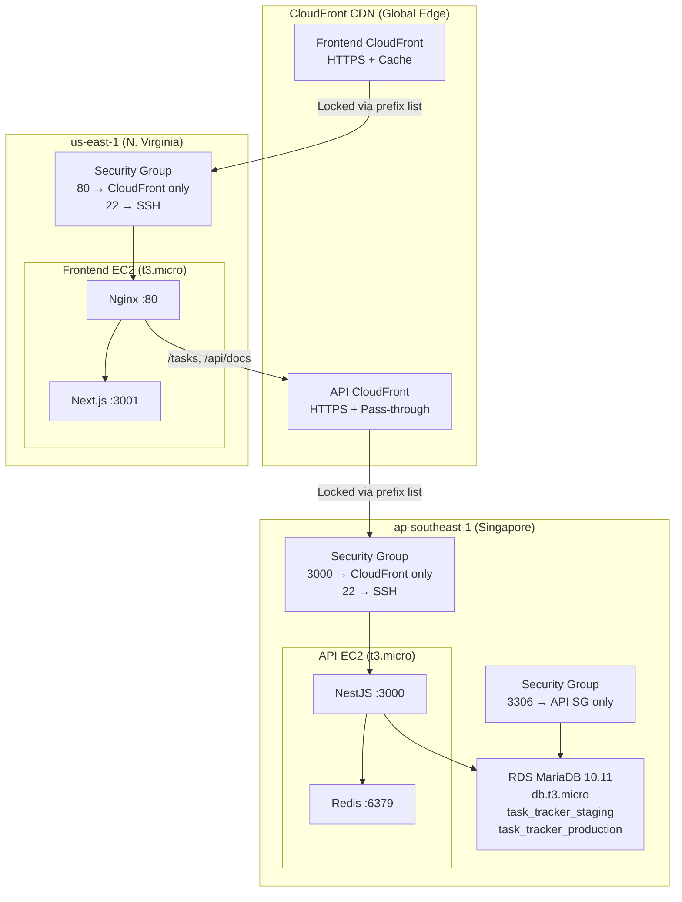
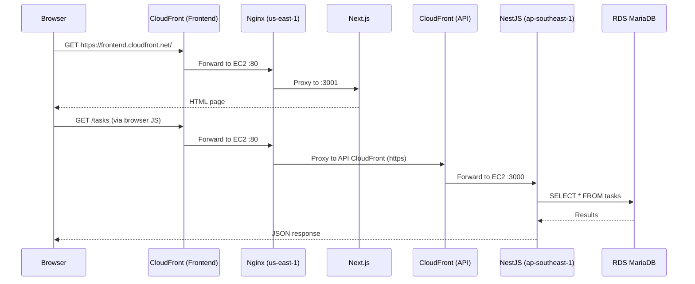
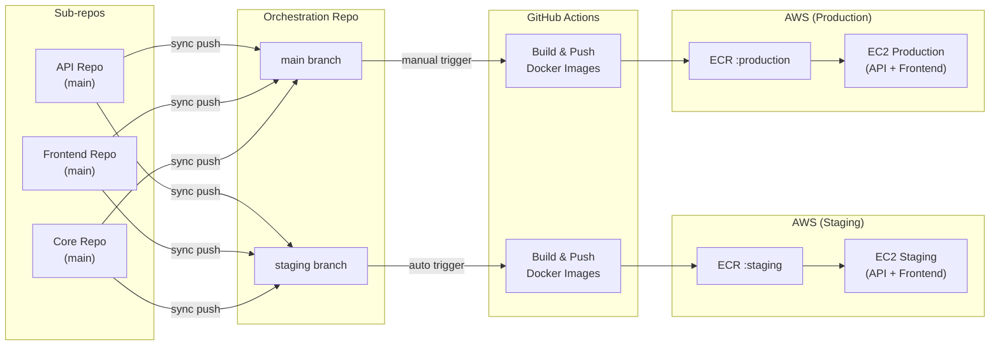

# AWS Infrastructure Setup Guide

## Architecture Overview

This project uses a **multi-region** deployment with CloudFront CDN:

- **API** → `ap-southeast-1` (Singapore) — close to RDS database
- **Frontend** → `us-east-1` (N. Virginia) — optimized for CloudFront
- **CloudFront** → Global CDN providing HTTPS, caching, and DDoS protection



## Request Flow



## AWS Resources

### Compute & Networking

| Resource | Region | Details |
|----------|--------|---------|
| EC2 API Staging | ap-southeast-1 | t3.micro, EIP: 13.229.192.200 |
| EC2 API Production | ap-southeast-1 | t3.micro, EIP: 13.214.79.66 |
| EC2 Frontend Staging | us-east-1 | t3.micro, EIP: 98.90.70.226 |
| EC2 Frontend Production | us-east-1 | t3.micro, EIP: 13.222.71.108 |
| RDS MariaDB | ap-southeast-1 | db.t3.micro, 10.11, 20GB gp2 |
| ECR ptt-api | ap-southeast-1 | API Docker images |
| ECR ptt-frontend | us-east-1 | Frontend Docker images |

### CloudFront Distributions

| Distribution | Domain | Origin |
|-------------|--------|--------|
| API Staging (E1ZNNY4LBTHMIF) | diofa9vowlzj6.cloudfront.net | API Staging EC2 :3000 |
| API Production (E1H0JVZQI5FCZG) | d270j9db8ffegc.cloudfront.net | API Production EC2 :3000 |
| Frontend Staging (E1NQFJER93057G) | d179mmtd1r518i.cloudfront.net | Frontend Staging EC2 :80 |
| Frontend Production (EEFTGCVP1R1HH) | d1w6dngwkrqpvq.cloudfront.net | Frontend Production EC2 :80 |

### Security Groups

| Group | Region | Rules |
|-------|--------|-------|
| ptt-api-sg | ap-southeast-1 | Port 3000: CloudFront prefix list only, Port 22: SSH |
| ptt-frontend-sg | us-east-1 | Port 80: CloudFront prefix list only, Port 22: SSH |
| ptt-rds-sg | ap-southeast-1 | Port 3306: API security group only |

> **Note**: EC2 ports are locked to CloudFront managed prefix lists (`pl-31a34658` for ap-southeast-1, `pl-3b927c52` for us-east-1). Direct IP access is blocked.

## Step-by-Step Setup

### 1. EC2 Key Pair

```bash
aws ec2 create-key-pair \
  --key-name personal-task-tracker-deploy \
  --query 'KeyMaterial' --output text > personal-task-tracker-deploy.pem
chmod 400 personal-task-tracker-deploy.pem
```

### 2. Security Groups

```bash
# API Security Group (ap-southeast-1)
aws ec2 create-security-group --group-name ptt-api-sg \
  --description "API for Task Tracker" --vpc-id <vpc-id> --region ap-southeast-1

# Allow SSH
aws ec2 authorize-security-group-ingress --group-id <sg-id> \
  --protocol tcp --port 22 --cidr 0.0.0.0/0

# Allow port 3000 from CloudFront only (managed prefix list)
aws ec2 authorize-security-group-ingress --group-id <sg-id> \
  --ip-permissions "IpProtocol=tcp,FromPort=3000,ToPort=3000,PrefixListIds=[{PrefixListId=pl-31a34658}]"

# Frontend Security Group (us-east-1)
aws ec2 create-security-group --group-name ptt-frontend-sg \
  --description "Frontend for Task Tracker" --vpc-id <vpc-id> --region us-east-1

# Allow port 80 from CloudFront only
aws ec2 authorize-security-group-ingress --group-id <sg-id> \
  --ip-permissions "IpProtocol=tcp,FromPort=80,ToPort=80,PrefixListIds=[{PrefixListId=pl-3b927c52}]"

# RDS Security Group (ap-southeast-1)
aws ec2 create-security-group --group-name ptt-rds-sg \
  --description "RDS for Task Tracker" --vpc-id <vpc-id> --region ap-southeast-1

# Allow MariaDB from API SG only
aws ec2 authorize-security-group-ingress --group-id <rds-sg-id> \
  --protocol tcp --port 3306 --source-group <api-sg-id>
```

### 3. RDS MariaDB

```bash
aws rds create-db-instance \
  --db-instance-identifier ptt-mariadb \
  --db-instance-class db.t3.micro \
  --engine mariadb \
  --engine-version "10.11" \
  --master-username admin \
  --master-user-password <your-secure-password> \
  --allocated-storage 20 \
  --storage-type gp2 \
  --vpc-security-group-ids <rds-sg-id> \
  --no-publicly-accessible \
  --backup-retention-period 7 \
  --no-multi-az
```

After RDS is available, create databases:
```sql
CREATE DATABASE task_tracker_staging;
CREATE DATABASE task_tracker_production;
CREATE USER 'taskuser'@'%' IDENTIFIED BY '<secure-password>';
GRANT ALL PRIVILEGES ON task_tracker_staging.* TO 'taskuser'@'%';
GRANT ALL PRIVILEGES ON task_tracker_production.* TO 'taskuser'@'%';
FLUSH PRIVILEGES;
```

### 4. ECR Repositories

```bash
# API ECR (ap-southeast-1)
aws ecr create-repository --repository-name ptt-api --region ap-southeast-1

# Frontend ECR (us-east-1)
aws ecr create-repository --repository-name ptt-frontend --region us-east-1
```

### 5. EC2 Instances

```bash
# Launch EC2 instances (Amazon Linux 2023, t3.micro)
# API instances in ap-southeast-1, Frontend instances in us-east-1

aws ec2 run-instances \
  --image-id <ami-id> \
  --instance-type t3.micro \
  --key-name personal-task-tracker-deploy \
  --security-group-ids <sg-id> \
  --tag-specifications 'ResourceType=instance,Tags=[{Key=Name,Value=ptt-api-staging}]'

# Allocate and associate Elastic IPs
aws ec2 allocate-address --domain vpc
aws ec2 associate-address --instance-id <instance-id> --allocation-id <eip-alloc-id>
```

Install Docker on each EC2:
```bash
sudo yum update -y
sudo yum install -y docker
sudo systemctl enable docker && sudo systemctl start docker
sudo usermod -aG docker ec2-user

# Install Docker Compose
sudo curl -L "https://github.com/docker/compose/releases/latest/download/docker-compose-$(uname -s)-$(uname -m)" \
  -o /usr/local/bin/docker-compose
sudo chmod +x /usr/local/bin/docker-compose
sudo ln -sf /usr/local/bin/docker-compose /usr/bin/docker-compose

# Configure AWS CLI for ECR login
aws configure
```

### 6. CloudFront Distributions

```bash
# API CloudFront (caching disabled, all HTTP methods allowed)
aws cloudfront create-distribution \
  --origin-domain-name <api-ec2-public-dns> \
  --default-cache-behavior '{
    "ViewerProtocolPolicy": "redirect-to-https",
    "AllowedMethods": ["GET","HEAD","OPTIONS","PUT","PATCH","POST","DELETE"],
    "CachePolicyId": "4135ea2d-6df8-44a3-9df3-4b5a84be39ad",
    "OriginRequestPolicyId": "216adef6-5c7f-47e4-b989-5492eafa07d3"
  }'

# Frontend CloudFront (standard caching)
aws cloudfront create-distribution \
  --origin-domain-name <frontend-ec2-public-dns> \
  --default-cache-behavior '{
    "ViewerProtocolPolicy": "redirect-to-https",
    "AllowedMethods": ["GET","HEAD"],
    "CachePolicyId": "658327ea-f89d-4fab-a63d-7e88639e58f6"
  }'
```

> **Important**: CloudFront origins must use EC2 public DNS names (not IPs).
> - ap-southeast-1: `ec2-{ip}.ap-southeast-1.compute.amazonaws.com`
> - us-east-1: `ec2-{ip}.compute-1.amazonaws.com`

### 7. EC2 Environment Files

Deploy `.env` files to each EC2:

**API EC2** (`/home/ec2-user/personal-task-tracker/.env`):
```env
AWS_ACCOUNT_ID=<account-id>
DB_HOST=<rds-endpoint>
DB_USERNAME=taskuser
DB_PASSWORD=<secure-password>
DB_DATABASE=task_tracker_staging
CORS_ORIGIN=https://<frontend-cloudfront-domain>
```

**Frontend EC2** (`/home/ec2-user/personal-task-tracker/.env`):
```env
AWS_ACCOUNT_ID=<account-id>
NEXT_PUBLIC_API_URL=https://<frontend-cloudfront-domain>
API_HOST=<api-cloudfront-domain>
```

## GitHub Secrets Required

### Sub-repos (API, Frontend, Core)

| Secret | Description |
|--------|-------------|
| `DOCKER_REPO_PAT` | GitHub PAT with repo access to push to orchestration repo |

### Orchestration Repo (personal-task-tracker)

| Secret | Description |
|--------|-------------|
| `AWS_ACCESS_KEY_ID` | AWS IAM access key |
| `AWS_SECRET_ACCESS_KEY` | AWS IAM secret key |
| `AWS_ACCOUNT_ID` | 12-digit AWS account ID |
| `STAGING_API_EC2_HOST` | Staging API EC2 Elastic IP |
| `STAGING_FRONTEND_EC2_HOST` | Staging Frontend EC2 Elastic IP |
| `STAGING_EC2_SSH_KEY` | SSH private key (.pem content) |
| `STAGING_API_URL` | Staging Frontend CloudFront URL |
| `PRODUCTION_API_EC2_HOST` | Production API EC2 Elastic IP |
| `PRODUCTION_FRONTEND_EC2_HOST` | Production Frontend EC2 Elastic IP |
| `PRODUCTION_EC2_SSH_KEY` | SSH private key (.pem content) |
| `PRODUCTION_API_URL` | Production Frontend CloudFront URL |

> **Note**: `STAGING_API_URL` and `PRODUCTION_API_URL` are the **Frontend CloudFront domains** (not the API CloudFront). `NEXT_PUBLIC_API_URL` is baked into the Next.js build — the browser makes requests to the same origin, and Nginx proxies `/tasks` to the API CloudFront.

## CI/CD Flow


