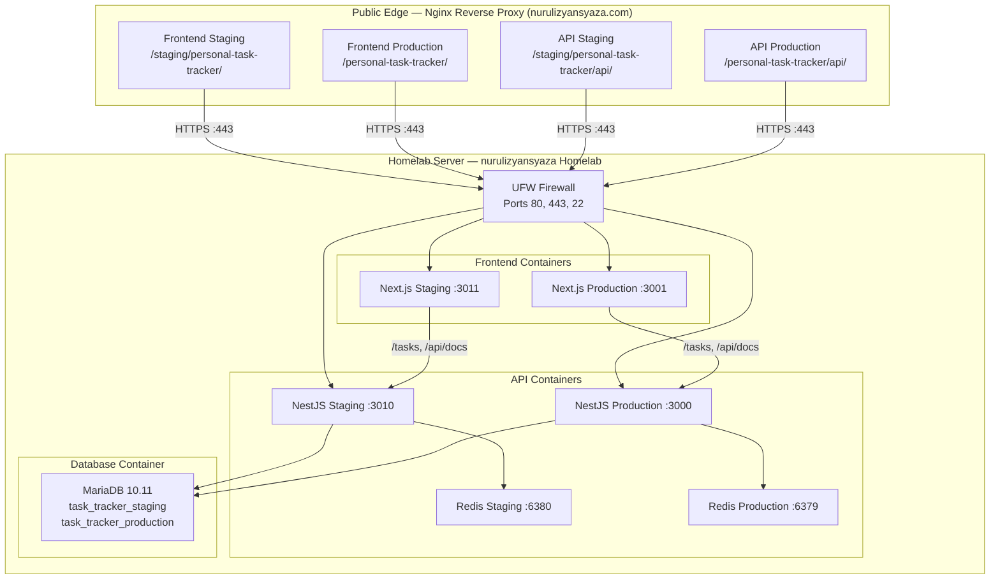
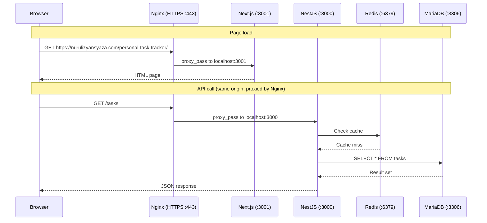
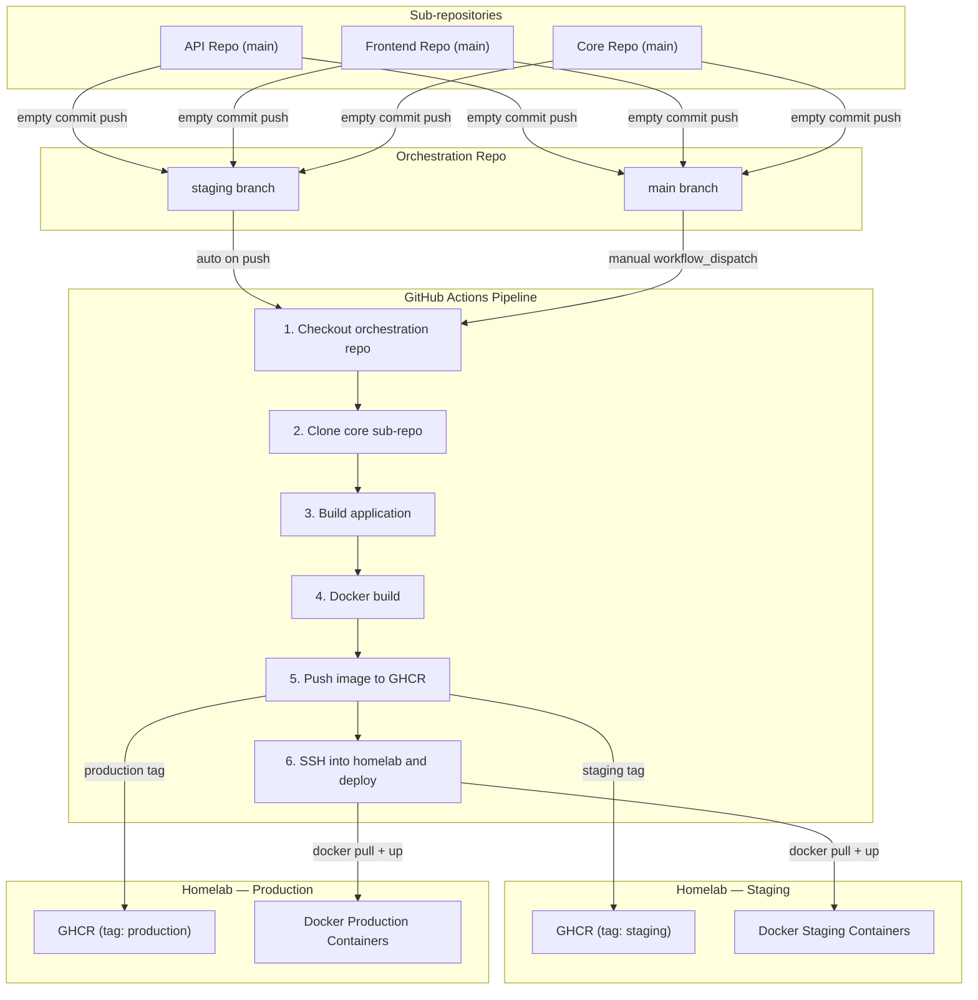

# Homelab Infrastructure Setup Guide

This guide walks through every resource used by Personal Task Tracker on a self-hosted
homelab server, how the pieces fit together, and how to recreate the infrastructure from
scratch. The project runs on a single machine using Docker containers with Nginx
providing HTTPS termination and reverse proxying via Let's Encrypt SSL certificates.

---

## Table of Contents

1. [Architecture Overview](#architecture-overview)
2. [Request Flow](#request-flow)
3. [Homelab Resources](#homelab-resources)
4. [Security](#security)
5. [Step-by-Step Setup](#step-by-step-setup)
6. [GitHub Secrets](#github-secrets)
7. [CI/CD Flow](#cicd-flow)
8. [Deployment Commands](#deployment-commands)
9. [Troubleshooting](#troubleshooting)
10. [Cost Estimate](#cost-estimate)

---

## Architecture Overview

The API, frontend, database, and Redis all run on a **single homelab server**. Nginx
acts as the public-facing reverse proxy, terminating HTTPS with Let's Encrypt
certificates and routing traffic to the appropriate Docker container. Every request
enters through Nginx so that application containers are never directly exposed to the
internet.



---

## Request Flow

When a user opens the application in a browser, two types of request happen. The
first loads the page itself. The second fetches task data from the API. Both go
through Nginx, but the API request takes an extra hop through the frontend's Nginx
server block so that browser same-origin restrictions are satisfied.



---

## Homelab Resources

### Server

| Resource | Details |
|---|---|
| Homelab Server | Single machine running Ubuntu/Debian |
| IP Address | your-homelab-ip (static IP or dynamic DNS) |
| OS | Ubuntu 22.04 LTS or Debian 12 |
| SSH Access | SSH key pair for remote administration |

Docker and Docker Compose are installed on the server. The Docker CLI is configured
so that `docker login` to GHCR works during deployment.

### Nginx Reverse Proxy

| Environment | Subpath | Origin | SSL |
|---|---|---|---|
| API Staging | /staging/personal-task-tracker/api/ | ptt-api-staging:3000 | Let's Encrypt |
| API Production | /personal-task-tracker/api/ | ptt-api-production:3000 | Let's Encrypt |
| Frontend Staging | /staging/personal-task-tracker/ | ptt-frontend-staging:3001 | Let's Encrypt |
| Frontend Production | /personal-task-tracker/ | ptt-frontend-production:3001 | Let's Encrypt |

> **Note:** All services are served under `nurulizyansyaza.com` using subpath routing
> in a single Nginx server block. Nginx proxies each location to the corresponding
> Docker container by name over the shared `ptt-network`. Container names are used
> instead of `localhost` ports so that Nginx (running in Docker or on the host with
> access to the Docker network) can resolve them reliably.

### Database

| Resource | Details |
|---|---|
| MariaDB Container | MariaDB 10.11, Docker container, 20 GB volume |
| Hostname | mariadb (Docker network alias) or localhost:3306 |
| Staging Database | task_tracker_staging |
| Production Database | task_tracker_production |
| Application User | taskuser (full privileges on both databases) |

Redis runs as a Docker sidecar container alongside each API container (port 6379 for
production, port 6380 for staging). There is no managed Redis cluster.

### Firewall

| Rule | Direction | Ports | Source |
|---|---|---|---|
| SSH | Inbound | TCP 22 | Your admin IP or 0.0.0.0/0 |
| HTTP | Inbound | TCP 80 | 0.0.0.0/0 (redirects to HTTPS) |
| HTTPS | Inbound | TCP 443 | 0.0.0.0/0 |
| Default | Inbound | All other | Deny |

### Container Registry

| Repository | Purpose |
|---|---|
| ghcr.io/nurulizyansyaza/ptt-api | API Docker images (tags: staging, production) |
| ghcr.io/nurulizyansyaza/ptt-frontend | Frontend Docker images (tags: staging, production) |

---

## Security

### Application Layer

| Layer | Mechanism | Description |
|---|---|---|
| HTTPS termination | Nginx + Let's Encrypt | All traffic is encrypted between the browser and Nginx |
| CORS | NestJS middleware | Only the frontend domain is allowed as an origin |
| API proxy | Nginx reverse proxy | The browser never contacts the API directly; Nginx forwards /tasks and /api/docs to the API container over localhost |
| Database credentials | Environment files | Stored in .env on the server, never committed to source control |
| Build-time variables | NEXT_PUBLIC_API_URL | Baked into the Next.js build so the browser requests the same origin and Nginx handles proxying |

### Infrastructure Layer

| Layer | Mechanism | Description |
|---|---|---|
| Network isolation | UFW firewall | Only ports 80, 443, and 22 are open; all application ports are bound to localhost only |
| Database network isolation | Docker network | MariaDB listens only on the internal Docker network; it is not exposed to the host or public internet |
| SSH access | Key pair authentication | The server uses an SSH key pair; password authentication is disabled |
| Container isolation | Docker networks | API and frontend containers communicate with MariaDB and Redis through a private Docker bridge network |
| Secrets management | GitHub Actions encrypted secrets | SSH keys and GHCR tokens are stored as repository secrets, never exposed in logs |

---

## Step-by-Step Setup

### Prerequisites

| Tool | Version | How to check | How to install |
|---|---|---|---|
| Docker | 20.x or later | `docker --version` | [Docker install guide](https://docs.docker.com/engine/install/ubuntu/) |
| Docker Compose | 2.x or later | `docker compose version` | Included with Docker Engine (plugin) |
| SSH client | any | `ssh -V` | Included with macOS and most Linux distributions |
| Certbot | any | `certbot --version` | [Certbot install guide](https://certbot.eff.org/) |

Make sure you have SSH access to your homelab server and that your user has
permission to run Docker commands:

```bash
# SSH into your homelab server.
# Replace your-homelab-ip with the actual IP address or hostname.
ssh your-user@your-homelab-ip
```

You should see output similar to:

```
Welcome to Ubuntu 22.04 LTS (GNU/Linux 5.15.0-xx-generic x86_64)
your-user@homelab:~$
```

---

### Step 1 -- Set Up the SSH Key Pair

The key pair lets you SSH into the homelab server securely. Create it on your local
machine and copy the public key to the server.

```bash
# Generate an SSH key pair.
# The -t flag specifies the key type (ed25519 is recommended for modern systems).
# The -C flag adds a comment to help identify the key.
ssh-keygen -t ed25519 \
  -C "personal-task-tracker-deploy" \
  -f ~/.ssh/personal-task-tracker-deploy

# Restrict file permissions so only you can read the private key.
# SSH will refuse to use the key if permissions are too open.
chmod 400 ~/.ssh/personal-task-tracker-deploy
```

You should see the files created with no errors:

```
$ ls -la ~/.ssh/personal-task-tracker-deploy*
-r--------  1 user  staff  419 ... personal-task-tracker-deploy
-rw-r--r--  1 user  staff  105 ... personal-task-tracker-deploy.pub
```

Now copy the public key to the homelab server so you can authenticate with it:

```bash
# Copy the public key to the server's authorized_keys file.
# This will prompt for the server password one last time.
ssh-copy-id -i ~/.ssh/personal-task-tracker-deploy.pub \
  your-user@your-homelab-ip
```

> **Note:** Keep `personal-task-tracker-deploy` (the private key) in a safe location.
> You will need it every time you SSH into the server, and it should never be shared
> or committed to source control.

---

### Step 2 -- Configure the UFW Firewall

UFW (Uncomplicated Firewall) acts as the network firewall for your server. It
defines which ports are open and where traffic is allowed to come from.

```bash
# SSH into the homelab server.
ssh -i ~/.ssh/personal-task-tracker-deploy your-user@your-homelab-ip
```

**Set up the default policies and allow necessary ports:**

```bash
# Set the default policy to deny all incoming traffic.
# This ensures only explicitly allowed ports are accessible.
sudo ufw default deny incoming

# Set the default policy to allow all outgoing traffic.
sudo ufw default allow outgoing

# Allow SSH so you can connect for administration.
# IMPORTANT: Do this BEFORE enabling UFW or you will lock yourself out.
sudo ufw allow 22/tcp

# Allow HTTP traffic (port 80).
# Nginx will redirect all HTTP requests to HTTPS.
sudo ufw allow 80/tcp

# Allow HTTPS traffic (port 443).
# This is the main entry point for all application traffic.
sudo ufw allow 443/tcp
```

You should see:

```
Rules updated
Rules updated (v6)
```

```bash
# Enable the firewall.
# Type 'y' when prompted to confirm.
sudo ufw enable

# Verify the firewall status and rules.
sudo ufw status verbose
```

You should see:

```
Status: active
Logging: on (low)
Default: deny (incoming), allow (outgoing), disabled (routed)

To                         Action      From
--                         ------      ----
22/tcp                     ALLOW IN    Anywhere
80/tcp                     ALLOW IN    Anywhere
443/tcp                    ALLOW IN    Anywhere
22/tcp (v6)                ALLOW IN    Anywhere (v6)
80/tcp (v6)                ALLOW IN    Anywhere (v6)
443/tcp (v6)               ALLOW IN    Anywhere (v6)
```

> **Tip:** For additional security, you can restrict SSH to your specific IP address:
> ```bash
> # Remove the open SSH rule and replace it with your IP.
> sudo ufw delete allow 22/tcp
> sudo ufw allow from YOUR_ADMIN_IP to any port 22 proto tcp
> ```

---

### Step 3 -- Set Up MariaDB in Docker

The database is shared between staging and production using separate database
names on the same container to keep resource usage low.

```bash
# Create a directory for the database data and configuration.
mkdir -p /home/your-user/personal-task-tracker/mariadb/data
mkdir -p /home/your-user/personal-task-tracker/mariadb/conf

# Create a Docker network for database communication.
# All containers that need database access will join this network.
docker network create ptt-network
```

You should see a network ID returned with no errors:

```
a1b2c3d4e5f6...
```

```bash
# Start the MariaDB container.
# --restart unless-stopped ensures it comes back up after a server reboot.
# The data volume persists database files across container restarts.
docker run -d \
  --name ptt-mariadb \
  --network ptt-network \
  --restart unless-stopped \
  -e MYSQL_ROOT_PASSWORD='<your-root-password>' \
  -v /home/your-user/personal-task-tracker/mariadb/data:/var/lib/mysql \
  -p 127.0.0.1:3306:3306 \
  mariadb:10.11
```

Wait for the container to finish initialising. This usually takes 10 to 30 seconds:

```bash
# Check the container logs until you see "ready for connections".
docker logs -f ptt-mariadb
```

You should see output ending with a line similar to:

```
... [Note] mariadbd: ready for connections.
```

Press `Ctrl+C` to stop following the logs.

Now connect to MariaDB to create the databases and application user:

```bash
# Connect to MariaDB using the root credentials.
docker exec -it ptt-mariadb mysql -u root -p
```

Run these SQL statements to create the two databases and the application user:

```sql
-- Create a database for each environment.
CREATE DATABASE task_tracker_staging;
CREATE DATABASE task_tracker_production;

-- Create the application user.
-- Replace <secure-password> with a strong password.
CREATE USER 'taskuser'@'%' IDENTIFIED BY '<secure-password>';

-- Grant full privileges on both databases.
GRANT ALL PRIVILEGES ON task_tracker_staging.* TO 'taskuser'@'%';
GRANT ALL PRIVILEGES ON task_tracker_production.* TO 'taskuser'@'%';

-- Apply the privilege changes.
FLUSH PRIVILEGES;
```

You should see `Query OK` after each statement.

---

### Step 4 -- Configure GHCR Authentication

GHCR (GitHub Container Registry) stores the Docker images that get deployed to the
homelab server. Both repositories live under the same GitHub user account.

```bash
# Create a GitHub Personal Access Token (classic) with the following scopes:
#   - read:packages (to pull images)
#   - write:packages (to push images from CI/CD)
#   - delete:packages (optional, to clean up old images)
#
# Generate the token at: https://github.com/settings/tokens
```

Log in to GHCR on the homelab server:

```bash
# Log in to GHCR using your GitHub username and the personal access token.
# The token is used as the password.
echo '<your-ghcr-token>' | docker login ghcr.io \
  --username nurulizyansyaza \
  --password-stdin
```

You should see:

```
Login Succeeded
```

Verify by pulling a test image (optional):

```bash
# Verify GHCR access by listing your packages.
docker pull ghcr.io/nurulizyansyaza/ptt-api:staging
```

You should see the image layers downloading with no authentication errors.

> **Note:** GHCR tokens do not expire automatically like ECR tokens, but you should
> still rotate them periodically. If you revoke the token, update both the server
> login and the `GHCR_TOKEN` GitHub Actions secret.

---

### Step 5 -- Set Up Docker Networks and Containers

All containers run on the same homelab server. Docker Compose manages the lifecycle
of each service. The `ptt-network` created in Step 3 connects all containers so
they can communicate by container name.

```bash
# Create the project directory structure.
mkdir -p /home/your-user/personal-task-tracker
cd /home/your-user/personal-task-tracker
```

**Install Docker and Docker Compose on the homelab server:**

```bash
# Update the system packages.
sudo apt-get update -y

# Install prerequisite packages.
sudo apt-get install -y ca-certificates curl gnupg

# Add Docker's official GPG key.
sudo install -m 0755 -d /etc/apt/keyrings
curl -fsSL https://download.docker.com/linux/ubuntu/gpg \
  | sudo gpg --dearmor -o /etc/apt/keyrings/docker.gpg
sudo chmod a+r /etc/apt/keyrings/docker.gpg

# Add the Docker repository.
echo \
  "deb [arch=$(dpkg --print-architecture) signed-by=/etc/apt/keyrings/docker.gpg] \
  https://download.docker.com/linux/ubuntu \
  $(. /etc/os-release && echo "$VERSION_CODENAME") stable" | \
  sudo tee /etc/apt/sources.list.d/docker.list > /dev/null

# Install Docker Engine and Docker Compose plugin.
sudo apt-get update -y
sudo apt-get install -y docker-ce docker-ce-cli containerd.io \
  docker-buildx-plugin docker-compose-plugin

# Add your user to the docker group so you can run docker without sudo.
sudo usermod -aG docker your-user

# Start Docker and enable it on boot.
sudo systemctl enable docker && sudo systemctl start docker
```

You should see Docker running:

```bash
docker --version
# Docker version 25.x.x, build ...

docker compose version
# Docker Compose version v2.x.x
```

**Create a docker-compose.yml for the production stack:**

```bash
cat > /home/your-user/personal-task-tracker/docker-compose.yml << 'EOF'
services:
  api:
    image: ghcr.io/nurulizyansyaza/ptt-api:production
    container_name: ptt-api-production
    restart: unless-stopped
    ports:
      - "127.0.0.1:3000:3000"
    env_file:
      - .env.api.production
    networks:
      - ptt-network
    depends_on:
      - redis

  redis:
    image: redis:7-alpine
    container_name: ptt-redis-production
    restart: unless-stopped
    ports:
      - "127.0.0.1:6379:6379"
    networks:
      - ptt-network

  frontend:
    image: ghcr.io/nurulizyansyaza/ptt-frontend:production
    container_name: ptt-frontend-production
    restart: unless-stopped
    ports:
      - "127.0.0.1:3001:3001"
    env_file:
      - .env.frontend.production
    networks:
      - ptt-network

networks:
  ptt-network:
    external: true
EOF
```

**Create a docker-compose.staging.yml for the staging stack:**

```bash
cat > /home/your-user/personal-task-tracker/docker-compose.staging.yml << 'EOF'
services:
  api-staging:
    image: ghcr.io/nurulizyansyaza/ptt-api:staging
    container_name: ptt-api-staging
    restart: unless-stopped
    ports:
      - "127.0.0.1:3010:3000"
    env_file:
      - .env.api.staging
    networks:
      - ptt-network
    depends_on:
      - redis-staging

  redis-staging:
    image: redis:7-alpine
    container_name: ptt-redis-staging
    restart: unless-stopped
    ports:
      - "127.0.0.1:6380:6379"
    networks:
      - ptt-network

  frontend-staging:
    image: ghcr.io/nurulizyansyaza/ptt-frontend:staging
    container_name: ptt-frontend-staging
    restart: unless-stopped
    ports:
      - "127.0.0.1:3011:3001"
    env_file:
      - .env.frontend.staging
    networks:
      - ptt-network

networks:
  ptt-network:
    external: true
EOF
```

---

### Step 6 -- Set Up Nginx with Let's Encrypt

Nginx provides HTTPS termination and protects application containers from direct
access. Certbot automates certificate issuance and renewal through Let's Encrypt.

```bash
# Install Nginx and Certbot.
sudo apt-get install -y nginx certbot python3-certbot-nginx

# Enable Nginx on boot.
sudo systemctl enable nginx
```

**Obtain SSL certificates for the domain:**

```bash
# Request a certificate for the domain.
# Certbot will configure Nginx automatically with the --nginx flag.
# Make sure your DNS records point to your homelab IP before running this.
sudo certbot --nginx \
  -d nurulizyansyaza.com \
  --non-interactive \
  --agree-tos \
  -m your-email@example.com
```

You should see:

```
Successfully received certificate.
Certificate is saved at: /etc/letsencrypt/live/nurulizyansyaza.com/fullchain.pem
Key is saved at:         /etc/letsencrypt/live/nurulizyansyaza.com/privkey.pem
```

**Verify automatic renewal is configured:**

```bash
# Certbot installs a systemd timer for automatic renewal.
# Certificates are renewed when they have less than 30 days until expiry.
sudo systemctl status certbot.timer
```

You should see `active (waiting)` in the output.

> **Note:** Let's Encrypt certificates are valid for 90 days. Certbot automatically
> renews them via the systemd timer. You can test renewal with:
> ```bash
> sudo certbot renew --dry-run
> ```
> You should see `Congratulations, all simulated renewals succeeded`.

---

### Step 7 -- Configure Environment Files

Each service needs an environment file that Docker Compose reads at startup. SSH into
the homelab server and create each file.

**API production environment** (`/home/your-user/personal-task-tracker/.env.api.production`):

```bash
ssh -i ~/.ssh/personal-task-tracker-deploy your-user@your-homelab-ip

mkdir -p /home/your-user/personal-task-tracker
cat > /home/your-user/personal-task-tracker/.env.api.production << 'EOF'
DB_HOST=ptt-mariadb
DB_USERNAME=taskuser
DB_PASSWORD=<secure-password>
DB_DATABASE=task_tracker_production
CORS_ORIGIN=https://nurulizyansyaza.com
REDIS_HOST=ptt-redis-production
REDIS_PORT=6379
EOF
```

**API staging environment** (`/home/your-user/personal-task-tracker/.env.api.staging`):

```bash
cat > /home/your-user/personal-task-tracker/.env.api.staging << 'EOF'
DB_HOST=ptt-mariadb
DB_USERNAME=taskuser
DB_PASSWORD=<secure-password>
DB_DATABASE=task_tracker_staging
CORS_ORIGIN=https://nurulizyansyaza.com
REDIS_HOST=ptt-redis-staging
REDIS_PORT=6379
EOF
```

**Frontend production environment** (`/home/your-user/personal-task-tracker/.env.frontend.production`):

```bash
cat > /home/your-user/personal-task-tracker/.env.frontend.production << 'EOF'
NEXT_PUBLIC_API_URL=/personal-task-tracker/api
API_HOST=ptt-api-production:3000
EOF
```

For the frontend staging environment, set `NEXT_PUBLIC_API_URL` to
`/staging/personal-task-tracker/api` and `API_HOST` to `ptt-api-staging:3000`.

```bash
cat > /home/your-user/personal-task-tracker/.env.frontend.staging << 'EOF'
NEXT_PUBLIC_API_URL=/staging/personal-task-tracker/api
API_HOST=ptt-api-staging:3000
EOF
```

> **Note:** `NEXT_PUBLIC_API_URL` is a **relative subpath** (e.g., `/personal-task-tracker/api`),
> not a full domain URL. The browser makes requests to the same origin it loaded the page from,
> and Nginx routes the subpath to the correct API container. This variable is baked into
> the Next.js build at build time and cannot be changed at runtime.

> **Note:** `API_HOST` is the address of the API container as seen from the Docker network.
> Since all containers share the `ptt-network`, Nginx and the frontend can reach the API
> by container name and internal port.

---

### Step 8 -- Set Up Redis as Docker Sidecar

Redis is used for caching on the API side. It runs as a Docker sidecar container
alongside each API container rather than as a standalone managed service to keep
the setup simple and costs at zero.

Redis containers are already defined in the Docker Compose files from Step 5. Start
them and verify they are running:

```bash
# Start the production Redis container.
cd /home/your-user/personal-task-tracker
docker compose up -d redis

# Verify Redis is running.
docker exec ptt-redis-production redis-cli ping
```

You should see:

```
PONG
```

```bash
# Start the staging Redis container.
docker compose -f docker-compose.staging.yml up -d redis-staging

# Verify staging Redis is running.
docker exec ptt-redis-staging redis-cli ping
```

You should see:

```
PONG
```

> **Tip:** Redis data is ephemeral by default in this setup. If you need persistence,
> add a volume mount to the Redis service in `docker-compose.yml`:
> ```yaml
> redis:
>   volumes:
>     - ./redis-data:/data
> ```

---

### Step 9 -- Configure Nginx Reverse Proxy

Nginx runs on the homelab server and does three things for each environment: it
serves the Next.js application, proxies `/tasks` to the API container, and proxies
`/api/docs` to the API container. Since all containers run on localhost, no
external HTTPS proxying is needed between services.

Create a single Nginx configuration for `nurulizyansyaza.com` with subpath routing:

```bash
sudo cat > /etc/nginx/sites-available/nurulizyansyaza << 'NGINX'
server {
    listen 443 ssl;
    server_name nurulizyansyaza.com;

    ssl_certificate /etc/letsencrypt/live/nurulizyansyaza.com/fullchain.pem;
    ssl_certificate_key /etc/letsencrypt/live/nurulizyansyaza.com/privkey.pem;

    # Production API — /personal-task-tracker/api/
    location /personal-task-tracker/api/ {
        proxy_pass http://ptt-api-production:3000/;
        proxy_http_version 1.1;
        proxy_set_header Host $host;
        proxy_set_header X-Real-IP $remote_addr;
        proxy_set_header X-Forwarded-For $proxy_add_x_forwarded_for;
        proxy_set_header X-Forwarded-Proto $scheme;
    }

    # Production Frontend — /personal-task-tracker/
    location /personal-task-tracker/ {
        proxy_pass http://ptt-frontend-production:3001/;
        proxy_http_version 1.1;
        proxy_set_header Upgrade $http_upgrade;
        proxy_set_header Connection 'upgrade';
        proxy_set_header Host $host;
        proxy_cache_bypass $http_upgrade;
        proxy_set_header X-Real-IP $remote_addr;
        proxy_set_header X-Forwarded-For $proxy_add_x_forwarded_for;
        proxy_set_header X-Forwarded-Proto $scheme;
    }

    # Staging API — /staging/personal-task-tracker/api/
    location /staging/personal-task-tracker/api/ {
        proxy_pass http://ptt-api-staging:3000/;
        proxy_http_version 1.1;
        proxy_set_header Host $host;
        proxy_set_header X-Real-IP $remote_addr;
        proxy_set_header X-Forwarded-For $proxy_add_x_forwarded_for;
        proxy_set_header X-Forwarded-Proto $scheme;
    }

    # Staging Frontend — /staging/personal-task-tracker/
    location /staging/personal-task-tracker/ {
        proxy_pass http://ptt-frontend-staging:3001/;
        proxy_http_version 1.1;
        proxy_set_header Upgrade $http_upgrade;
        proxy_set_header Connection 'upgrade';
        proxy_set_header Host $host;
        proxy_cache_bypass $http_upgrade;
        proxy_set_header X-Real-IP $remote_addr;
        proxy_set_header X-Forwarded-For $proxy_add_x_forwarded_for;
        proxy_set_header X-Forwarded-Proto $scheme;
    }
}

server {
    listen 80;
    server_name nurulizyansyaza.com;
    return 301 https://$host$request_uri;
}
NGINX
```

Enable the site configuration and start Nginx:

```bash
# Enable the site by creating a symlink.
sudo ln -sf /etc/nginx/sites-available/nurulizyansyaza /etc/nginx/sites-enabled/

# Remove the default server block to avoid conflicts.
sudo rm -f /etc/nginx/sites-enabled/default

# Test the configuration.
sudo nginx -t

# Start Nginx.
sudo systemctl start nginx
```

You should see:

```
nginx: the configuration file /etc/nginx/nginx.conf syntax is ok
nginx: configuration file /etc/nginx/nginx.conf test is successful
```

> **Note:** Since all containers run on the same Docker network, Nginx proxies
> directly to container names (e.g., `ptt-api-production:3000`). There is no need for
> `proxy_ssl_server_name` or external HTTPS between Nginx and the backend services.
> All routing is handled through subpath `location` blocks in a single server block
> for `nurulizyansyaza.com`.

---

## GitHub Secrets

### Orchestration Repository (personal-task-tracker)

| Secret | Description |
|---|---|
| `GHCR_TOKEN` | GitHub Personal Access Token with `write:packages` scope for pushing images to GHCR |
| `HOMELAB_HOST` | your-homelab-ip |
| `HOMELAB_SSH_KEY` | Full content of the personal-task-tracker-deploy private key |
| `HOMELAB_USER` | SSH username on the homelab server (e.g., your-user) |
| `STAGING_API_URL` | /staging/personal-task-tracker/api (Frontend Staging API path) |
| `PRODUCTION_API_URL` | /personal-task-tracker/api (Frontend Production API path) |

> **Note:** `STAGING_API_URL` and `PRODUCTION_API_URL` are relative subpath prefixes,
> not full domain URLs. The CI/CD pipeline passes these values as
> `NEXT_PUBLIC_API_URL` during the Docker build so that the browser makes requests to
> the same origin using subpath routing, and Nginx handles the proxying.

### Sub-repositories (API, Frontend, Core)

| Secret | Description |
|---|---|
| `DOCKER_REPO_PAT` | GitHub Personal Access Token with `repo` scope, used to push empty commits to the orchestration repository and trigger CI/CD |

---

## CI/CD Flow

Sub-repositories (API, Frontend, Core) do not deploy directly. Instead, they push
an empty commit to the orchestration repository, which triggers the actual build
and deployment pipeline.



**Staging** deploys automatically whenever a commit is pushed to the `staging`
branch. **Production** requires a manual trigger using `workflow_dispatch` on the
`main` branch.

The pipeline steps in detail:

1. **Checkout** -- Clone the orchestration repository.
2. **Clone core** -- Pull the shared core library sub-repository.
3. **Build** -- Run the application build (NestJS compile or Next.js build).
4. **Docker build** -- Build the Docker image with the application baked in.
5. **Push to GHCR** -- Tag the image as `staging` or `production` and push to the
   appropriate GHCR repository.
6. **SSH deploy** -- Connect to the homelab server via SSH, pull the new image from
   GHCR, and restart the container with `docker compose up -d`.

---

## Deployment Commands

### Manual Staging Deployment

Push a commit to the `staging` branch of the orchestration repository. The pipeline
triggers automatically:

```bash
# From the orchestration repo.
git checkout staging
git commit --allow-empty -m "deploy: trigger staging build"
git push origin staging
```

### Manual Production Deployment

Production requires a manual trigger from the GitHub Actions UI or the CLI:

```bash
# Trigger the production workflow from the command line.
gh workflow run deploy-production.yml --ref main
```

### Deploy Directly to the Homelab Server

If you need to bypass CI/CD for debugging, SSH into the server and deploy
manually:

```bash
# SSH into the homelab server.
ssh -i ~/.ssh/personal-task-tracker-deploy your-user@your-homelab-ip

# Navigate to the project directory.
cd /home/your-user/personal-task-tracker

# Log in to GHCR.
echo '<your-ghcr-token>' | docker login ghcr.io \
  --username nurulizyansyaza \
  --password-stdin

# Pull the latest images.
docker pull ghcr.io/nurulizyansyaza/ptt-api:staging
docker pull ghcr.io/nurulizyansyaza/ptt-frontend:staging

# Restart the staging containers.
docker compose -f docker-compose.staging.yml up -d

# Pull and restart production containers.
docker pull ghcr.io/nurulizyansyaza/ptt-api:production
docker pull ghcr.io/nurulizyansyaza/ptt-frontend:production
docker compose up -d
```

### Reload Nginx After Configuration Changes

After updating Nginx configuration, test and reload without downtime:

```bash
# Test the configuration for syntax errors.
sudo nginx -t

# Reload Nginx to apply changes without dropping active connections.
sudo systemctl reload nginx
```

You should see `syntax is ok` and `test is successful` from the test command.

---

## Troubleshooting

### Nginx returns 502 Bad Gateway

**Cause:** The backend container is not running, or it is not listening on the
expected port. Nginx cannot reach the upstream service.

**Fix:** Check that the container is running and the port mapping is correct:

```bash
# List running containers and their port mappings.
docker ps --format "table {{.Names}}\t{{.Status}}\t{{.Ports}}"

# Check if the specific container is healthy.
docker logs ptt-api-production --tail 50

# If the container is stopped, restart it.
cd /home/your-user/personal-task-tracker
docker compose up -d
```

---

### Docker network connectivity issues

**Cause:** Containers are not on the same Docker network, or the network was
recreated without restarting dependent containers.

**Fix:** Verify all containers are on the `ptt-network` and can resolve each other:

```bash
# List containers on the ptt-network.
docker network inspect ptt-network \
  --format '{{range .Containers}}{{.Name}} {{end}}'

# Test connectivity from the API container to MariaDB.
docker exec ptt-api-production ping -c 3 ptt-mariadb

# If containers are missing from the network, restart them.
docker compose down && docker compose up -d
```

---

### Frontend shows stale data after API changes

**Cause:** `NEXT_PUBLIC_API_URL` is baked into the Next.js build at build time. If
you change it in the environment file after building, the browser still uses the old
value.

**Fix:** Rebuild the frontend Docker image so the new value is compiled in:

```bash
# Trigger a new staging deployment.
git checkout staging
git commit --allow-empty -m "rebuild: update NEXT_PUBLIC_API_URL"
git push origin staging
```

---

### MariaDB connection refused from API container

**Cause:** The MariaDB container is not on the `ptt-network`, or the container name
does not match the `DB_HOST` value in the environment file.

**Fix:** Verify the network setup and environment configuration:

```bash
# Check the MariaDB container is running and on the correct network.
docker inspect ptt-mariadb \
  --format '{{range $net, $conf := .NetworkSettings.Networks}}{{$net}} {{end}}'

# Verify the DB_HOST value matches the MariaDB container name.
grep DB_HOST /home/your-user/personal-task-tracker/.env.api.production

# Test the connection from the API container.
docker exec ptt-api-production sh -c \
  'mysql -h ptt-mariadb -u taskuser -p -e "SELECT 1"'
```

The expected output from the network inspect command should include `ptt-network`.

---

### Docker pull fails with "denied" or "unauthorized"

**Cause:** The GHCR authentication token has expired, been revoked, or was never
configured on the server.

**Fix:** Log in to GHCR again:

```bash
echo '<your-ghcr-token>' | docker login ghcr.io \
  --username nurulizyansyaza \
  --password-stdin
```

If the token was revoked, generate a new one at
[github.com/settings/tokens](https://github.com/settings/tokens) with the
`read:packages` and `write:packages` scopes, then update the `GHCR_TOKEN` GitHub
Actions secret.

---

### UFW blocks legitimate traffic

**Cause:** A UFW rule is missing or was accidentally deleted, preventing HTTP/HTTPS
traffic from reaching Nginx.

**Fix:** Verify the firewall rules and re-add any missing ones:

```bash
# Check current UFW rules.
sudo ufw status numbered

# If port 443 is missing, add it back.
sudo ufw allow 443/tcp

# If port 80 is missing, add it back.
sudo ufw allow 80/tcp

# Reload the firewall.
sudo ufw reload
```

The correct rules are:

| Port | Protocol | Action |
|---|---|---|
| 22 | TCP | ALLOW |
| 80 | TCP | ALLOW |
| 443 | TCP | ALLOW |

---

## Cost Estimate

All resources run on a single homelab server. The main ongoing costs are electricity,
internet, and domain registration. There are no cloud provider usage fees.

| Resource | One-Time Cost | Estimated Monthly Cost |
|---|---|---|
| Homelab Server (used/refurbished mini PC or SBC) | ~$100 – $300 | $0.00 (amortised) |
| Electricity (~50W average draw) | -- | ~$5.00 – $10.00 |
| Internet (existing home connection) | -- | $0.00 (already paying) |
| Domain Name (.com registration) | ~$10 – $15/year | ~$1.00 |
| Let's Encrypt SSL Certificates | -- | $0.00 (free) |
| GHCR Storage | -- | $0.00 (free for public repos, 500 MB free for private) |
| Docker + Redis + MariaDB | -- | $0.00 (runs on server) |
| Dynamic DNS (optional, e.g., DuckDNS) | -- | $0.00 (free) |

**Estimated ongoing total: ~$6.00 – $11.00/month.**

Hardware amortisation depends on what you already own. A used mini PC (e.g., Intel
NUC, Lenovo ThinkCentre Tiny) with 8 GB RAM and a 256 GB SSD is more than sufficient
for this project. If you already have a server, the marginal cost is just electricity
and the domain name.

> **Tip:** Shut down staging containers when not in use to reduce CPU and memory
> consumption on the homelab server:
> ```bash
> # Stop the staging containers to free resources.
> cd /home/your-user/personal-task-tracker
> docker compose -f docker-compose.staging.yml down
>
> # Start them again when needed.
> docker compose -f docker-compose.staging.yml up -d
> ```
