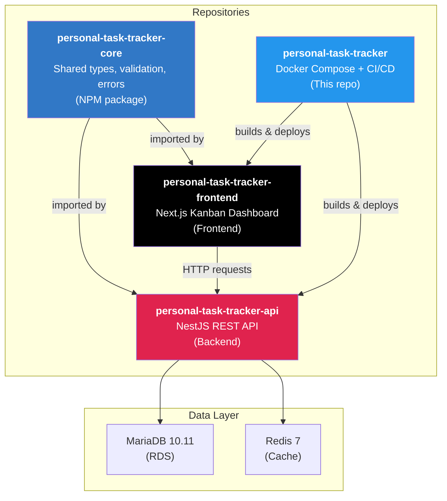
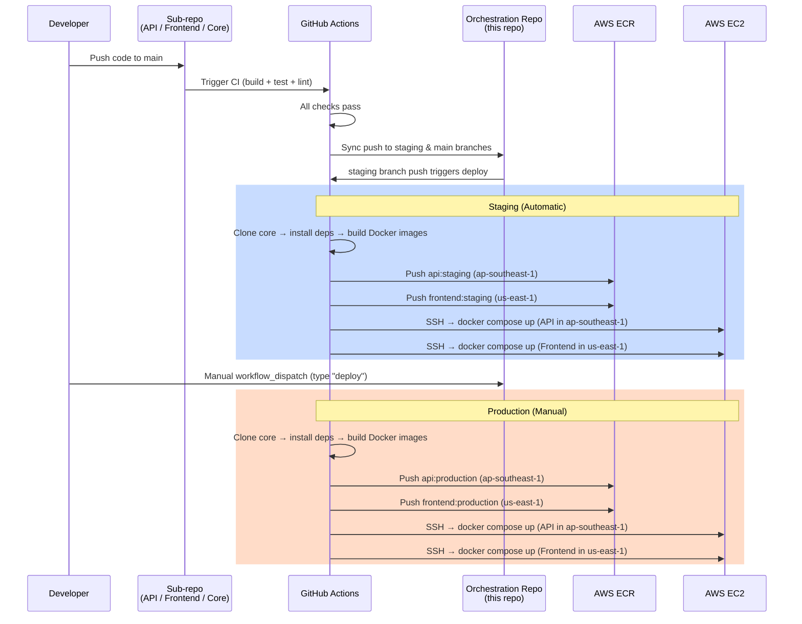
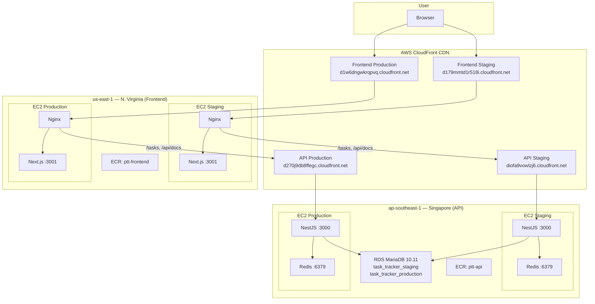

# Personal Task Tracker


A full-stack **Kanban task management application** built with NestJS, Next.js, and TypeScript. Drag and drop tasks between columns, create and edit with modals, and filter by status — all deployed on AWS with automated CI/CD.

**This is the orchestration repository** — it holds Docker Compose configurations and GitHub Actions workflows that tie together the 4 project repositories.

---

## Table of Contents

- [What It Does](#what-it-does)
- [Architecture Overview](#architecture-overview)
- [Tech Stack](#tech-stack)
- [Quick Start](#quick-start)
- [Testing](#testing)
- [API Testing with Bruno](#api-testing-with-bruno)
- [Project Structure](#project-structure)
- [Deployment](#deployment)
- [AWS Infrastructure](#aws-infrastructure)
- [Environment Variables](#environment-variables)
- [Live URLs](#live-urls)
- [Future Improvements](#future-improvements)

---

## What It Does

Personal Task Tracker is a **Kanban board** for managing your personal tasks. Here's what you can do:

- **Kanban Board View** — Tasks are organized into three columns: **To Do**, **In Progress**, and **Done**
- **Drag & Drop** — Move tasks between columns by dragging them (powered by `@dnd-kit`)
- **Create Tasks** — Click a button to open a modal and create a new task with a title, description, and status
- **Edit Tasks** — Click any task card to open it in a modal, then edit the title, description, or status
- **Delete Tasks** — Remove tasks you no longer need, with a confirmation dialog to prevent accidents
- **Filter by Status** — Quickly filter the board to show only tasks in a specific status
- **Real-time Updates** — The UI updates instantly after every action using React Query's cache invalidation
- **Loading Skeletons** — Smooth loading states so the board never feels janky
- **Toast Notifications** — Success and error messages appear as toasts so you always know what happened
- **Swagger API Docs** — Full interactive API documentation available at `/api/docs`

---

## Architecture Overview

This project is split across **4 repositories** that work together:



### Why 4 Repos?

| Repository | Purpose | Why Separate? |
|---|---|---|
| [`personal-task-tracker-core`](https://github.com/nurulizyansyaza/personal-task-tracker-core) | Shared TypeScript types, validation rules, error classes, and constants | Avoids duplicating types between API and Frontend — both import the same package |
| [`personal-task-tracker-api`](https://github.com/nurulizyansyaza/personal-task-tracker-api) | NestJS REST API with CRUD endpoints, Swagger docs, health checks | Backend has its own dependencies (TypeORM, MariaDB driver) and deploy target |
| [`personal-task-tracker-frontend`](https://github.com/nurulizyansyaza/personal-task-tracker-frontend) | Next.js Kanban dashboard with drag-and-drop | Frontend has its own dependencies (React, Tailwind) and deploy target |
| [`personal-task-tracker`](https://github.com/nurulizyansyaza/personal-task-tracker) (this repo) | Docker Compose files, CI/CD workflows, Nginx configs | Orchestration is separate so sub-repos stay focused on their own code |

---

## Tech Stack

### Core Package

| Technology | Version | Purpose |
|---|---|---|
| TypeScript | 5 | Type-safe shared code |
| Jest | 30 | Unit testing |

### Backend (API)

| Technology | Version | Purpose |
|---|---|---|
| NestJS | 11 | REST API framework |
| TypeORM | — | Database ORM for MariaDB |
| MariaDB | 10.11 | Relational database (via AWS RDS) |
| Redis | 7 | Caching layer |
| Swagger | — | Interactive API documentation |
| Helmet | — | HTTP security headers |
| class-validator | — | Request body validation (uses rules from core package) |

### Frontend

| Technology | Version | Purpose |
|---|---|---|
| Next.js | 16 | React framework with SSR |
| React | 19 | UI component library |
| Tailwind CSS | 4 | Utility-first CSS styling |
| @dnd-kit | — | Drag-and-drop for Kanban board |
| React Query (TanStack) | 5 | Server state management and caching |
| react-hot-toast | — | Toast notifications |

### Infrastructure

| Technology | Purpose |
|---|---|
| Docker & Docker Compose | Containerization and local development |
| GitHub Actions | CI/CD pipelines |
| AWS EC2 | Compute instances (4 total) |
| AWS RDS | Managed MariaDB database |
| AWS ECR | Docker image registry |
| AWS CloudFront | CDN, HTTPS, and DDoS protection |
| Nginx | Reverse proxy on frontend EC2 instances |

---

## Quick Start

You have two options for running this project locally:

### Option A: Local Development with Docker (Recommended)

> **Best for**: Getting everything running with a single command. No need to install MariaDB or Redis on your machine.

**Prerequisites:**
- [Docker Desktop](https://www.docker.com/products/docker-desktop/) (includes Docker Compose)
- [Git](https://git-scm.com/downloads)
- [Node.js 20+](https://nodejs.org/) (needed to build the core package)

**Step 1: Clone all 4 repositories**

```bash
# Create a project folder and clone everything into it
mkdir personal-task-tracker-project && cd personal-task-tracker-project

git clone https://github.com/nurulizyansyaza/personal-task-tracker.git
git clone https://github.com/nurulizyansyaza/personal-task-tracker-core.git
git clone https://github.com/nurulizyansyaza/personal-task-tracker-api.git
git clone https://github.com/nurulizyansyaza/personal-task-tracker-frontend.git
```

**Step 2: Build the core package**

The API and Frontend both depend on this shared package, so build it first:

```bash
cd personal-task-tracker-core
npm install
npm run build
cd ..
```

**Step 3: Install dependencies for API and Frontend**

```bash
cd personal-task-tracker-api && npm install && cd ..
cd personal-task-tracker-frontend && npm install && cd ..
```

**Step 4: Start everything with Docker Compose**

```bash
cd personal-task-tracker
cp .env.local.example .env
docker compose -f docker-compose.local.yml up --build
```

This starts **5 containers**:
| Container | Port | What It Does |
|---|---|---|
| MariaDB | 3306 | Database |
| Redis | 6379 | Cache |
| NestJS API | 3000 | Backend REST API |
| Next.js Frontend | 3001 | Kanban dashboard |
| Nginx | 80 | Reverse proxy (routes traffic) |

**Step 5: Open the app**

| URL | What You'll See |
|---|---|
| [http://localhost](http://localhost) | Kanban board (main app) |
| [http://localhost:3000/api/docs](http://localhost:3000/api/docs) | Swagger API documentation |
| [http://localhost:3000/health](http://localhost:3000/health) | API health check |

> **Tip:** The local setup includes hot-reload — edit API or Frontend code and see changes instantly without restarting containers.

---

### Option B: Manual Setup (Without Docker)

> **Best for**: When you want to run each service individually, or if you prefer not to use Docker.

**Prerequisites:**
- [Node.js 20+](https://nodejs.org/)
- [MariaDB 10.11](https://mariadb.org/download/) (or MySQL)
- [Redis](https://redis.io/download/)
- [Git](https://git-scm.com/downloads)

**Step 1: Clone all 4 repositories** (same as Option A)

```bash
mkdir personal-task-tracker-project && cd personal-task-tracker-project

git clone https://github.com/nurulizyansyaza/personal-task-tracker.git
git clone https://github.com/nurulizyansyaza/personal-task-tracker-core.git
git clone https://github.com/nurulizyansyaza/personal-task-tracker-api.git
git clone https://github.com/nurulizyansyaza/personal-task-tracker-frontend.git
```

**Step 2: Build the core package**

```bash
cd personal-task-tracker-core
npm install
npm run build
cd ..
```

**Step 3: Set up and start the API**

```bash
cd personal-task-tracker-api
npm install

# Create a .env file (see .env.example in the API repo for all variables)
# At minimum, you need:
# DB_HOST=localhost
# DB_PORT=3306
# DB_USERNAME=your_db_user
# DB_PASSWORD=your_db_password
# DB_DATABASE=task_tracker
# REDIS_HOST=localhost
# REDIS_PORT=6379
# CORS_ORIGIN=http://localhost:3001

npm run start:dev
# API is now running at http://localhost:3000
```

**Step 4: Set up and start the Frontend**

```bash
# Open a new terminal
cd personal-task-tracker-frontend
npm install

# Create a .env file:
# NEXT_PUBLIC_API_URL=http://localhost:3000

npm run dev
# Frontend is now running at http://localhost:3001
```

**Step 5: Open the app**

| URL | What You'll See |
|---|---|
| [http://localhost:3001](http://localhost:3001) | Kanban board |
| [http://localhost:3000/api/docs](http://localhost:3000/api/docs) | Swagger API documentation |

---

## Testing

The project has **178 tests** across all 3 code repositories:

| Repository | Tests | What's Tested |
|---|---|---|
| `personal-task-tracker-core` | 42 | Error classes, validation rules, constants, type exports |
| `personal-task-tracker-api` | 84 (74 unit + 10 integration) | Controllers, services, DTOs, entities, config, filters, interceptors |
| `personal-task-tracker-frontend` | 52 | API client, hooks, Kanban components (card, column, modal, skeleton) |

### How to Run Tests

Each repository has its own test suite. Run them from the respective repo folder:

```bash
# Core package tests (42 tests)
cd personal-task-tracker-core
npm test

# API tests (84 tests)
cd personal-task-tracker-api
npm test # Run all unit tests
npm run test:ptt-tomei # Run integration tests
npm run test:cov # Run with coverage report

# Frontend tests (67 tests)
cd personal-task-tracker-frontend
npm test # Run all tests
npm run test:cov # Run with coverage report
```

> **Tip:** Use `npm run test:watch` in any repo to re-run tests automatically when you save a file.

---

## API Testing with Bruno

The API repo includes a [Bruno](https://www.usebruno.com/) collection with **22 pre-built requests** for testing the API manually. Bruno is a free, open-source API client (like Postman, but stores collections as files in your repo).

### What's Included

| Folder | Requests | Description |
|---|---|---|
| `health/` | 1 | Health check endpoint |
| `tasks/` | 9 | CRUD operations — create, read, update, delete tasks |
| `tasks-errors/` | 5 | Error scenarios — not found, invalid ID, non-existent task |
| `tasks-validation/` | 7 | Validation — missing title, empty body, title too long, invalid status |

### 3 Pre-configured Environments

| Environment | Base URL | When to Use |
|---|---|---|
| **Local** | `http://localhost:3000` | Testing against your local dev server |
| **Staging** | `https://diofa9vowlzj6.cloudfront.net` | Testing against the staging deployment |
| **Production** | `https://d270j9db8ffegc.cloudfront.net` | Testing against the production deployment |

### How to Use

1. Install [Bruno](https://www.usebruno.com/) (free desktop app)
2. Open Bruno and click **"Open Collection"**
3. Navigate to `personal-task-tracker-api/bruno/` and open it
4. Select an environment from the dropdown (Local, Staging, or Production)
5. Click any request and hit **Send**

---

## Project Structure

### This Repository (Orchestration)

```
personal-task-tracker/
├── .github/
│ └── workflows/
│ ├── deploy-staging.yml # Auto-deploy on push to staging branch
│ └── deploy-production.yml # Manual deploy via workflow_dispatch
├── nginx/
│ ├── default.conf # Nginx config for local development
│ └── default.conf.template # Nginx config for staging/production (with envsubst)
├── scripts/
│ └── setup-ec2.sh # EC2 instance bootstrap script
├── docker-compose.local.yml # Local dev (API + Frontend + MariaDB + Redis + Nginx)
├── docker-compose.api-staging.yml # Staging API (ECR image + Redis)
├── docker-compose.api-production.yml # Production API (ECR image + Redis)
├── docker-compose.frontend-staging.yml # Staging Frontend (ECR image + Nginx)
├── docker-compose.frontend-production.yml # Production Frontend (ECR image + Nginx)
├── .env.local.example # Environment vars for local development
├── .env.api.example # Environment vars for API EC2 instances
├── .env.frontend.example # Environment vars for Frontend EC2 instances
├── .env.staging.example # Environment vars reference for staging
├── AWS-INFRASTRUCTURE.md # Detailed AWS setup guide
└── README.md # You are here!
```

### Core Package

```
personal-task-tracker-core/
├── src/
│ ├── index.ts # Package entry point (re-exports everything)
│ ├── types.ts # TypeScript interfaces (Task, CreateTaskDto, etc.)
│ ├── validation.ts # Validation rules (title length, allowed statuses, etc.)
│ ├── errors.ts # Custom error classes (NotFoundError, ValidationError, etc.)
│ └── constants.ts # Shared constants (task statuses, limits)
├── tests/ # 42 unit tests
├── jest.config.js
├── tsconfig.json
└── package.json
```

### Backend API

```
personal-task-tracker-api/
├── src/
│ ├── main.ts # App bootstrap (Swagger, Helmet, CORS)
│ ├── app.module.ts # Root module
│ ├── tasks/
│ │ ├── tasks.module.ts # Tasks feature module
│ │ ├── tasks.controller.ts # REST endpoints (GET, POST, PATCH, DELETE)
│ │ ├── tasks.service.ts # Business logic + Redis caching
│ │ ├── dto/ # Request/response DTOs with class-validator
│ │ └── entities/ # TypeORM entity (maps to MariaDB table)
│ ├── health/
│ │ ├── health.module.ts # Health check module
│ │ ├── health.controller.ts # GET /health endpoint
│ │ └── health.service.ts # DB + Redis connectivity checks
│ ├── config/ # Database and Redis configuration
│ └── common/
│ ├── filters/ # Global exception filter
│ └── interceptors/ # Request logging interceptor
├── test/ # Integration tests
├── bruno/ # Bruno API collection (22 requests)
├── Dockerfile
└── package.json
```

### Frontend

```
personal-task-tracker-frontend/
├── src/
│ ├── app/
│ │ ├── layout.tsx # Root layout
│ │ ├── page.tsx # Home page (renders KanbanBoard)
│ │ └── globals.css # Tailwind CSS imports
│ ├── components/
│ │ ├── Providers.tsx # React Query + Toast provider wrapper
│ │ └── kanban/
│ │   ├── KanbanBoard.tsx # Main board with drag-and-drop context
│ │   ├── KanbanColumn.tsx # Single column (To Do / In Progress / Done)
│ │   ├── KanbanCard.tsx # Draggable task card
│ │   ├── TaskModal.tsx # Create/edit task modal
│ │   ├── DeleteConfirmModal.tsx # Delete confirmation dialog
│ │   └── KanbanSkeleton.tsx # Loading skeleton for the board
│ ├── hooks/
│ │ ├── useTasks.ts # React Query hooks (CRUD operations)
│ │ ├── useTaskModal.ts # Modal open/close/submit state management
│ │ └── useDeleteConfirmation.ts # Delete confirmation state management
│ ├── lib/
│ │ ├── api.ts # Axios HTTP client for the API
│ │ └── status-config.ts # Shared status labels, colors, column config
│ └── test/
│   └── mocks.ts # Shared mock task factory for tests
├── Dockerfile
└── package.json
```

---

## Deployment

### How Deployment Works

The project uses a **sync-to-orchestration** pattern:

1. You push code to a sub-repo (`personal-task-tracker-api`, `personal-task-tracker-frontend`, or `personal-task-tracker-core`)
2. GitHub Actions in the sub-repo runs CI (build, test, lint)
3. If CI passes, it **automatically syncs** a push to this orchestration repo's `staging` and `main` branches
4. That push triggers the deployment workflows in **this** repo

### Staging (Automatic)

Staging deploys **automatically** every time code is pushed to the `staging` branch:

```
Push to sub-repo → CI passes → Sync to orchestration staging branch → Auto deploy
```

No manual steps needed. Just push your code and staging updates within minutes.

### Production (Manual)

Production deploys require a **manual trigger** for safety:

1. Go to the [Actions tab](https://github.com/nurulizyansyaza/personal-task-tracker/actions) in this repo
2. Select the **"Deploy Production"** workflow
3. Click **"Run workflow"**
4. Type `deploy` in the confirmation field
5. Click **"Run workflow"** again

### Deployment Pipeline



---

## AWS Infrastructure

The application runs on a **multi-region AWS setup** with CloudFront as the entry point:



### Key Components

| Component | Details |
|---|---|
| **EC2 Instances** | 4 × t3.micro — API staging, API production (ap-southeast-1), Frontend staging, Frontend production (us-east-1) |
| **RDS Database** | MariaDB 10.11 on db.t3.micro, 20GB gp2 storage. One instance, two databases (`task_tracker_staging`, `task_tracker_production`) |
| **Redis** | Runs as a Docker sidecar on API EC2 instances (128MB max memory, LRU eviction) |
| **ECR Repositories** | `ptt-api` in ap-southeast-1, `ptt-frontend` in us-east-1 |
| **CloudFront** | 4 distributions providing HTTPS, caching, and DDoS protection. Hides EC2 public IPs |
| **Security Groups** | Ports 80/3000 only accept traffic from CloudFront managed prefix lists. SSH open for management |
| **Key Pair** | `personal-task-tracker-deploy` (used for SSH access to all EC2 instances) |

### Why Multi-Region?

- **API in ap-southeast-1 (Singapore)** — Closest to the RDS database to minimize query latency
- **Frontend in us-east-1 (N. Virginia)** — CloudFront's primary edge location, optimized for global distribution
- **Cross-region routing** — Nginx on the Frontend EC2 proxies `/tasks` and `/api/docs` to the API via CloudFront, so the frontend never talks directly to the API EC2

> For the complete setup guide (step-by-step EC2, RDS, CloudFront, and security group configuration), see [AWS-INFRASTRUCTURE.md](./AWS-INFRASTRUCTURE.md).

---

## Environment Variables

### GitHub Secrets (Required for CI/CD)

These secrets must be configured in this repository's GitHub Settings → Secrets and variables → Actions:

| Secret | Description |
|---|---|
| `AWS_ACCESS_KEY_ID` | AWS IAM access key for ECR push and EC2 deploy |
| `AWS_SECRET_ACCESS_KEY` | AWS IAM secret key |
| `AWS_REGION` | Primary AWS region (e.g., `ap-southeast-1`) |
| `AWS_ACCOUNT_ID` | AWS account ID (for ECR image URIs) |
| `STAGING_EC2_HOST` | Elastic IP of the staging API EC2 instance |
| `STAGING_EC2_SSH_KEY` | SSH private key for staging EC2 access |
| `PRODUCTION_EC2_HOST` | Elastic IP of the production API EC2 instance |
| `PRODUCTION_EC2_SSH_KEY` | SSH private key for production EC2 access |
| `STAGING_API_URL` | Staging API URL (e.g., `https://diofa9vowlzj6.cloudfront.net`) |
| `PRODUCTION_API_URL` | Production API URL (e.g., `https://d270j9db8ffegc.cloudfront.net`) |
| `DOCKER_REPO_PAT` | GitHub Personal Access Token for syncing to this orchestration repo |

### Local Development (.env)

Copy `.env.local.example` to `.env` and adjust if needed:

| Variable | Default | Description |
|---|---|---|
| `DB_ROOT_PASSWORD` | `password` | MariaDB root password |
| `DB_USERNAME` | `taskuser` | Database username |
| `DB_PASSWORD` | `taskpassword` | Database password |
| `DB_DATABASE` | `task_tracker` | Database name |

### EC2 API Instances (.env on server)

See `.env.api.example` for the template:

| Variable | Description |
|---|---|
| `AWS_ACCOUNT_ID` | AWS account ID (for ECR image pull) |
| `DB_HOST` | RDS endpoint |
| `DB_USERNAME` | Database username |
| `DB_PASSWORD` | Database password |
| `DB_DATABASE` | `task_tracker_staging` or `task_tracker_production` |
| `CORS_ORIGIN` | Frontend CloudFront URL |

### EC2 Frontend Instances (.env on server)

See `.env.frontend.example` for the template:

| Variable | Description |
|---|---|
| `AWS_ACCOUNT_ID` | AWS account ID (for ECR image pull) |
| `NEXT_PUBLIC_API_URL` | Frontend CloudFront URL (where Nginx proxies API requests) |
| `API_HOST` | API CloudFront domain (used by Nginx template) |

---

## Live URLs

### Staging

| Service | URL |
|---|---|
| Frontend (Kanban Board) | [https://d179mmtd1r518i.cloudfront.net](https://d179mmtd1r518i.cloudfront.net) |
| API | [https://diofa9vowlzj6.cloudfront.net](https://diofa9vowlzj6.cloudfront.net) |
| Swagger API Docs | [https://diofa9vowlzj6.cloudfront.net/api/docs](https://diofa9vowlzj6.cloudfront.net/api/docs) |
| Health Check | [https://diofa9vowlzj6.cloudfront.net/health](https://diofa9vowlzj6.cloudfront.net/health) |

### Production

| Service | URL |
|---|---|
| Frontend (Kanban Board) | [https://d1w6dngwkrqpvq.cloudfront.net](https://d1w6dngwkrqpvq.cloudfront.net) |
| API | [https://d270j9db8ffegc.cloudfront.net](https://d270j9db8ffegc.cloudfront.net) |
| Swagger API Docs | [https://d270j9db8ffegc.cloudfront.net/api/docs](https://d270j9db8ffegc.cloudfront.net/api/docs) |
| Health Check | [https://d270j9db8ffegc.cloudfront.net/health](https://d270j9db8ffegc.cloudfront.net/health) |

---

## Future Improvements

- **Custom Domain** — Add a custom domain with Route 53 + ACM certificates (instead of CloudFront URLs)
- **ECS Fargate** — Migrate from bare EC2 to ECS Fargate for managed container orchestration
- **ElastiCache** — Replace Docker-hosted Redis with AWS ElastiCache for better reliability
- **Blue-Green Deploys** — Implement blue-green or rolling deployments for zero-downtime releases
- **E2E Tests** — Add comprehensive end-to-end tests with Playwright
- **Monitoring** — Set up CloudWatch dashboards and SNS alerting for production monitoring
- **Database Migrations** — Switch from TypeORM `synchronize: true` to proper migration scripts
- **Infrastructure as Code** — Add Terraform or AWS CDK for reproducible infrastructure provisioning

---

## Related Repositories

| Repo | Description | Tests |
|------|-------------|-------|
| [personal-task-tracker](https://github.com/nurulizyansyaza/personal-task-tracker) | Orchestration — CI/CD, Docker, AWS infra | — |
| [personal-task-tracker-core](https://github.com/nurulizyansyaza/personal-task-tracker-core) | Shared TypeScript library — types, validation, errors | 42 |
| [personal-task-tracker-api](https://github.com/nurulizyansyaza/personal-task-tracker-api) | NestJS REST API with security middleware | 84 |
| [personal-task-tracker-frontend](https://github.com/nurulizyansyaza/personal-task-tracker-frontend) | Next.js Kanban dashboard | 52 |
