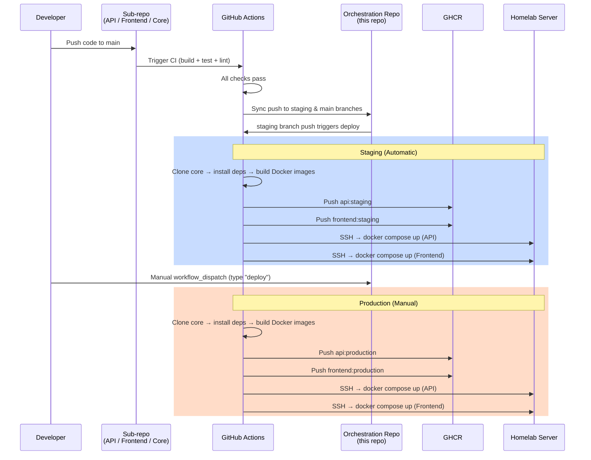
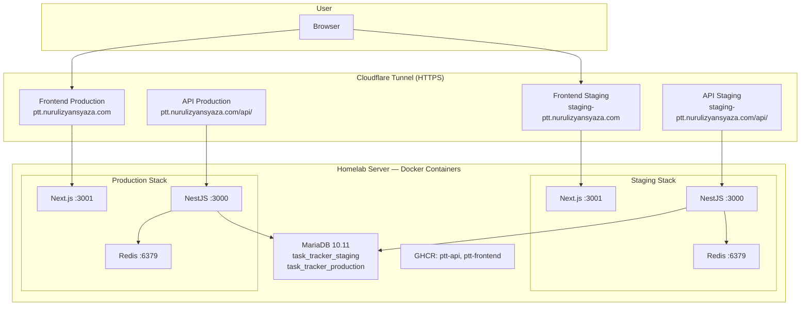

# Personal Task Tracker


A full-stack **Kanban task management application** built with NestJS, Next.js, and TypeScript. Drag and drop tasks between columns, mark them done with a checkbox, sort by date or status, and keep working offline — all deployed on a self-hosted homelab server with automated CI/CD.

**This is the orchestration repository** — it holds Docker Compose configurations and GitHub Actions workflows that tie together the 4 project repositories.

---

## Table of Contents

- [What It Does](#what-it-does)
- [Architecture Overview](#architecture-overview)
- [Tech Stack](#tech-stack)
- [Quick Start](#quick-start)
- [Testing](#testing)
- [Swagger API Docs](#swagger-api-docs)
- [API Testing with Bruno](#api-testing-with-bruno)
- [Project Structure](#project-structure)
- [Deployment](#deployment)
- [Homelab Infrastructure](#homelab-infrastructure)
- [Environment Variables](#environment-variables)
- [Live URLs](#live-urls)
- [Assumptions and Tradeoffs](#assumptions-and-tradeoffs)

---

## What It Does

Personal Task Tracker is a **Kanban board** for managing your personal tasks. Here's what you can do:

- **Kanban Board View** — Tasks are organized into three columns: **To Do**, **In Progress**, and **Done**
- **Drag & Drop** — Move tasks between columns by dragging them (powered by `@dnd-kit`)
- **Mark as Done** — Single-click checkbox on each card to toggle between Done and To Do
- **Sort Tasks** — Sort by creation date (newest/oldest) or by status via a dropdown
- **Create Tasks** — Click a button to open a modal and create a new task with a title, description, and status
- **Edit Tasks** — Click any task card to open it in a modal, then edit the title, description, or status
- **Delete Tasks** — Remove tasks you no longer need, with a confirmation dialog to prevent accidents
- **Filter by Status** — Quickly filter the board to show only tasks in a specific status
- **Offline Support** — Tasks are cached in localStorage; the board still works when the API is unreachable
- **Real-time Updates** — The UI updates instantly after every action using React Query's cache invalidation
- **Loading Skeletons** — Smooth loading states so the board never feels janky
- **Toast Notifications** — Success and error messages appear as toasts so you always know what happened
- **Swagger API Docs** — Full interactive API documentation available at `/api/docs`

---

## Architecture Overview

This project is split across **4 repositories** that work together:


### Why 4 Repos?

| Repository | Purpose | Why Separate? |
|---|---|---|
| [`personal-task-tracker-core`](https://github.com/nurulizyansyaza/personal-task-tracker-core) | Shared TypeScript types, validation rules, error classes, and constants | Avoids duplicating types between API and Frontend — both import the same package |
| [`personal-task-tracker-api`](https://github.com/nurulizyansyaza/personal-task-tracker-api) | NestJS REST API with CRUD endpoints, Swagger docs, health checks | Backend has its own dependencies (TypeORM, MariaDB driver) and deploy target |
| [`personal-task-tracker-frontend`](https://github.com/nurulizyansyaza/personal-task-tracker-frontend) | Next.js Kanban dashboard with drag-and-drop | Frontend has its own dependencies (React, Tailwind) and deploy target |
| [`personal-task-tracker`](https://github.com/nurulizyansyaza/personal-task-tracker) (this repo) | Docker Compose files, CI/CD workflows, Nginx configs | Orchestration is separate so sub-repos stay focused on their own code |

---

## Tech Stack

### Core Package

| Technology | Version | Purpose |
|---|---|---|
| TypeScript | 5 | Type-safe shared code |
| Jest | 30 | Unit testing |

### Backend (API)

| Technology | Version | Purpose |
|---|---|---|
| NestJS | 11 | REST API framework |
| TypeORM | — | Database ORM for MariaDB |
| MariaDB | 10.11 | Relational database (via Docker container) |
| Redis | 7 | Caching layer |
| Swagger | — | Interactive API documentation |
| Helmet | — | HTTP security headers |
| class-validator | — | Request body validation (uses rules from core package) |

### Frontend

| Technology | Version | Purpose |
|---|---|---|
| Next.js | 16 | React framework with SSR |
| React | 19 | UI component library |
| Tailwind CSS | 4 | Utility-first CSS styling |
| @dnd-kit | — | Drag-and-drop for Kanban board |
| React Query (TanStack) | 5 | Server state management and caching |
| react-hot-toast | — | Toast notifications |

### Infrastructure

| Technology | Purpose |
|---|---|
| Docker & Docker Compose | Containerization and local development |
| GitHub Actions | CI/CD pipelines |
| Homelab Server | Self-hosted Docker host (single machine) |
| MariaDB (Docker) | Database running in Docker container |
| GitHub Container Registry (GHCR) | Docker image registry |
| Nginx + Cloudflare Tunnel | Reverse proxy with HTTPS via Cloudflare Tunnel |
| UFW Firewall | Host-level firewall rules |

---

## Quick Start

You have two options for running this project locally:

### Option A: Local Development with Docker (Recommended)

> **Best for**: Getting everything running with a single command. No need to install MariaDB or Redis on your machine.

**Prerequisites:**
- [Docker Desktop](https://www.docker.com/products/docker-desktop/) (includes Docker Compose)
- [Git](https://git-scm.com/downloads)
- [Node.js 20+](https://nodejs.org/) (needed to build the core package)

**Step 1: Clone all 4 repositories**

```bash
# Create a project folder and clone everything into it
mkdir personal-task-tracker-project && cd personal-task-tracker-project

git clone https://github.com/nurulizyansyaza/personal-task-tracker.git
git clone https://github.com/nurulizyansyaza/personal-task-tracker-core.git
git clone https://github.com/nurulizyansyaza/personal-task-tracker-api.git
git clone https://github.com/nurulizyansyaza/personal-task-tracker-frontend.git
```

**Step 2: Start everything with the helper script**

The helper script builds the core package, prepares Docker build contexts, and starts all services:

```bash
cd personal-task-tracker
./scripts/local-docker.sh up
```

To run in detached mode (background):

```bash
./scripts/local-docker.sh up -d
```

To stop everything:

```bash
./scripts/local-docker.sh down
```

> The script automatically copies the core package into the API and Frontend build contexts (mirroring what CI/CD does), then cleans up when finished.

This starts **5 containers**:
| Container | Host Port | What It Does |
|---|---|---|
| MariaDB | 3307 | Database (internal port 3306) |
| Redis | 6380 | Cache (internal port 6379) |
| NestJS API | 3100 | Backend REST API (internal port 3000) |
| Next.js Frontend | 3101 | Kanban dashboard (internal port 3001) |
| Nginx | 8080 | Reverse proxy (routes traffic) |

> Ports are offset to avoid conflicts with local services (MariaDB, Redis, Nginx) you may already have running.

**Step 3: Open the app**

| URL | What You'll See |
|---|---|
| [http://localhost:8080](http://localhost:8080) | Kanban board (main app) |
| [http://localhost:8080/api/docs](http://localhost:8080/api/docs) | Swagger API documentation (via nginx) |
| [http://localhost:3100/api/docs](http://localhost:3100/api/docs) | Swagger API documentation (direct) |
| [http://localhost:8080/health](http://localhost:8080/health) | API health check |

---

### Option B: Manual Setup (Without Docker)

> **Best for**: When you want to run each service individually, or if you prefer not to use Docker.

**Prerequisites:**
- [Node.js 20+](https://nodejs.org/)
- [MariaDB 10.11](https://mariadb.org/download/) (or MySQL)
- [Redis](https://redis.io/download/)
- [Git](https://git-scm.com/downloads)

**Step 1: Clone all 4 repositories** (same as Option A)

```bash
mkdir personal-task-tracker-project && cd personal-task-tracker-project

git clone https://github.com/nurulizyansyaza/personal-task-tracker.git
git clone https://github.com/nurulizyansyaza/personal-task-tracker-core.git
git clone https://github.com/nurulizyansyaza/personal-task-tracker-api.git
git clone https://github.com/nurulizyansyaza/personal-task-tracker-frontend.git
```

**Step 2: Build the core package**

```bash
cd personal-task-tracker-core
npm install
npm run build
cd ..
```

**Step 3: Set up and start the API**

```bash
cd personal-task-tracker-api
npm install

# Create a .env file (see .env.example in the API repo for all variables)
# At minimum, you need:
# DB_HOST=localhost
# DB_PORT=3306
# DB_USERNAME=your_db_user
# DB_PASSWORD=your_db_password
# DB_DATABASE=task_tracker
# REDIS_HOST=localhost
# REDIS_PORT=6379
# CORS_ORIGIN=http://localhost:3001

npm run start:dev
# API is now running at http://localhost:3000
```

**Step 4: Set up and start the Frontend**

```bash
# Open a new terminal
cd personal-task-tracker-frontend
npm install

# Create a .env file:
# NEXT_PUBLIC_API_URL=http://localhost:3000

npm run dev
# Frontend is now running at http://localhost:3001
```

**Step 5: Open the app**

| URL | What You'll See |
|---|---|
| [http://localhost:3001](http://localhost:3001) | Kanban board |
| [http://localhost:3000/api/docs](http://localhost:3000/api/docs) | Swagger API documentation |

---

## Testing

The project has **211 tests** across all 3 code repositories:

| Repository | Tests | What's Tested |
|---|---|---|
| `personal-task-tracker-core` | 41 | Error classes, validation rules, constants, type exports |
| `personal-task-tracker-api` | 74 (64 unit + 10 integration) | Controllers, services, DTOs, entities, config, filters, interceptors |
| `personal-task-tracker-frontend` | 96 | API client, localStorage fallback, hooks (sort, modal, delete), Kanban components (card, column, modal, skeleton) |

### How to Run Tests

#### Via Docker (recommended — no local Node.js setup required)

```bash
cd personal-task-tracker

# Run ALL 211 tests at once
./scripts/local-docker.sh test

# Run individual repo tests
docker compose -f docker-compose.local.yml run --rm test-core      # Core — 41 tests
docker compose -f docker-compose.local.yml run --rm test-api       # API — 74 tests
docker compose -f docker-compose.local.yml run --rm test-frontend  # Frontend — 96 tests
```

#### Via npm (from each repo folder)

```bash
# Core package tests (41 tests)
cd personal-task-tracker-core
npm test

# API tests (74 tests)
cd personal-task-tracker-api
npm test                   # Run all unit tests
npm run test:ptt-tomei     # Run integration tests
npm run test:cov           # Run with coverage report

# Frontend tests (96 tests)
cd personal-task-tracker-frontend
npm test                   # Run all tests
npm run test:cov           # Run with coverage report
```

> **Tip:** Use `npm run test:watch` in any repo to re-run tests automatically when you save a file.

---

## Swagger API Docs

The API includes interactive documentation powered by [Swagger / OpenAPI](https://swagger.io/). Every endpoint is documented with request/response schemas, query parameters, and error codes — and you can test them directly from the browser.

### Accessing Swagger UI

| Environment | URL |
|---|---|
| **Local (Docker)** | [http://localhost:8080/api/docs](http://localhost:8080/api/docs) or [http://localhost:3100/api/docs](http://localhost:3100/api/docs) |
| **Local (Manual)** | [http://localhost:3000/api/docs](http://localhost:3000/api/docs) |
| **Staging** | `https://staging-ptt.nurulizyansyaza.com/api/docs` |
| **Production** | `https://ptt.nurulizyansyaza.com/api/docs` |

### How to Use

1. Open any of the URLs above in your browser.
2. All endpoints are grouped under **Tasks** and **Health** tags.
3. Click an endpoint to expand it and see parameters, request body schema, and response examples.
4. Click **"Try it out"**, fill in the fields, and click **"Execute"** to send a live request.
5. The response body, status code, and headers appear inline.

### What's Documented

- All CRUD endpoints (`GET`, `POST`, `PUT`, `DELETE` for `/tasks`)
- Health check endpoint (`GET /health`)
- Success response wrapper: `{ success, data, message }`
- Error response structure: `{ success: false, statusCode, error, message, errors[], timestamp, path }`
- Enum values for task status (TODO, IN_PROGRESS, DONE)
- Validation constraints and error codes

---

## API Testing with Bruno

The API repo includes a [Bruno](https://www.usebruno.com/) collection with **23 pre-built requests** for testing the API manually. Bruno is a free, open-source API client (like Postman, but stores collections as files in your repo).

### What's Included

| Folder | Requests | Description |
|---|---|---|
| `health/` | 2 | Health check, Swagger docs |
| `tasks/` | 8 | CRUD operations — create, read, update, delete tasks |
| `tasks-errors/` | 6 | Error scenarios — not found, invalid ID, non-existent task |
| `tasks-validation/` | 7 | Validation — missing title, empty body, title too long, invalid status |

### 3 Pre-configured Environments

| Environment | Base URL | When to Use |
|---|---|---|
| **Local** | `http://localhost:3000` | Testing against your local dev server (use `http://localhost:3100` with Docker) |
| **Staging** | `https://staging-ptt.nurulizyansyaza.com` | Testing against the staging deployment |
| **Production** | `https://ptt.nurulizyansyaza.com` | Testing against the production deployment |

### How to Use

1. Install [Bruno](https://www.usebruno.com/) (free desktop app)
2. Open Bruno and click **"Open Collection"**
3. Navigate to `personal-task-tracker-api/bruno/` and open it
4. Select an environment from the dropdown (Local, Staging, or Production)
5. Click any request and hit **Send**

Each request includes:
- Pre-filled request body with realistic example data
- Assertions that validate response status codes and body structure
- Documentation describing expected behaviour and response format

---

## Project Structure

### This Repository (Orchestration)

```
personal-task-tracker/
├── .github/
│ └── workflows/
│ ├── deploy-staging.yml # Auto-deploy on push to staging branch
│ └── deploy-production.yml # Manual deploy via workflow_dispatch
├── nginx/
│ ├── default.conf # Nginx config for local development
│ └── default.conf.template # Nginx config for staging/production (with envsubst)
├── scripts/
│ ├── setup-homelab.sh # Homelab server bootstrap script
│ └── local-docker.sh # Helper script for local Docker setup
├── docker-compose.local.yml # Local dev (API + Frontend + MariaDB + Redis + Nginx)
├── docker-compose.api-staging.yml # Staging API (GHCR image + Redis)
├── docker-compose.api-production.yml # Production API (GHCR image + Redis)
├── docker-compose.frontend-staging.yml # Staging Frontend (GHCR image)
├── docker-compose.frontend-production.yml # Production Frontend (GHCR image)
├── docker-compose.nginx.yml         # Shared Nginx reverse proxy
├── .env.local.example # Environment vars for local development
├── .env.api.example # Environment vars for API on homelab
├── .env.frontend.example # Environment vars for Frontend on homelab
├── .env.staging.example # Environment vars reference for staging
├── HOMELAB-INFRASTRUCTURE.md # Detailed homelab setup guide
└── README.md # You are here!
```

### Core Package

```
personal-task-tracker-core/
├── src/
│ ├── index.ts # Package entry point (re-exports everything)
│ ├── types.ts # TypeScript interfaces (Task, CreateTaskDto, etc.)
│ ├── validation.ts # Validation rules (title length, allowed statuses, etc.)
│ ├── errors.ts # Custom error classes (NotFoundError, ValidationError, etc.)
│ └── constants.ts # Shared constants (task statuses, limits)
├── tests/ # 41 unit tests
├── jest.config.js
├── tsconfig.json
└── package.json
```

### Backend API

```
personal-task-tracker-api/
├── src/
│ ├── main.ts # App bootstrap (Swagger, Helmet, CORS)
│ ├── app.module.ts # Root module
│ ├── tasks/
│ │ ├── tasks.module.ts # Tasks feature module
│ │ ├── tasks.controller.ts # REST endpoints (GET, POST, PUT, DELETE)
│ │ ├── tasks.service.ts # Business logic + Redis caching
│ │ ├── dto/ # Request/response DTOs with class-validator
│ │ └── entities/ # TypeORM entity (maps to MariaDB table)
│ ├── health/
│ │ ├── health.module.ts # Health check module
│ │ ├── health.controller.ts # GET /health endpoint
│ │ └── health.service.ts # DB + Redis connectivity checks
│ ├── config/ # Database and Redis configuration
│ └── common/
│ ├── dto/ # Swagger response schema DTOs
│ ├── filters/ # Global exception filter
│ └── interceptors/ # Request logging interceptor
├── test/ # Integration tests
├── bruno/ # Bruno API collection (23 requests)
├── Dockerfile
└── package.json
```

### Frontend

```
personal-task-tracker-frontend/
├── src/
│ ├── app/
│ │ ├── layout.tsx # Root layout
│ │ ├── page.tsx # Home page (renders KanbanBoard)
│ │ └── globals.css # Tailwind CSS imports
│ ├── components/
│ │ ├── Providers.tsx # React Query + Toast provider wrapper
│ │ └── kanban/
│ │   ├── KanbanBoard.tsx # Main board with drag-and-drop context and sort dropdown
│ │   ├── KanbanColumn.tsx # Single column (To Do / In Progress / Done)
│ │   ├── KanbanCard.tsx # Task card: checkbox, edit/delete/drag icons, date
│ │   ├── TaskModal.tsx # Create/edit task modal
│ │   ├── DeleteConfirmModal.tsx # Delete confirmation dialog
│ │   └── KanbanSkeleton.tsx # Loading skeleton for the board
│ ├── hooks/
│ │ ├── useTasks.ts # React Query hooks (CRUD operations)
│ │ ├── useTaskModal.ts # Modal open/close/submit state management
│ │ ├── useDeleteConfirmation.ts # Delete confirmation state management
│ │ └── useTaskSort.ts # Client-side sort by date or status
│ ├── lib/
│ │ ├── api.ts # Axios HTTP client with localStorage fallback
│ │ ├── local-storage.ts # localStorage CRUD cache for offline support
│ │ └── status-config.ts # Shared status labels, colors, column config
│ └── test/
│   └── mocks.ts # Shared mock task factory for tests
├── Dockerfile
└── package.json
```

---

## Deployment

### How Deployment Works

The project uses a **sync-to-orchestration** pattern:

1. You push code to a sub-repo (`personal-task-tracker-api`, `personal-task-tracker-frontend`, or `personal-task-tracker-core`)
2. GitHub Actions in the sub-repo runs CI (build, test, lint)
3. If CI passes, it **automatically syncs** a push to this orchestration repo's `staging` and `main` branches
4. That push triggers the deployment workflows in **this** repo

### Staging (Automatic)

Staging deploys **automatically** every time code is pushed to the `staging` branch:

```
Push to sub-repo → CI passes → Sync to orchestration staging branch → Auto deploy
```

No manual steps needed. Just push your code and staging updates within minutes.

### Production (Manual)

Production deploys require a **manual trigger** for safety:

**Option 1: Via GitHub UI**

1. Go to the [Actions tab](https://github.com/nurulizyansyaza/personal-task-tracker/actions) in this repo
2. Select the **"Deploy to Production"** workflow
3. Click **"Run workflow"**
4. Select the `main` branch
5. Type `deploy` in the confirmation field
6. Click **"Run workflow"** again

**Option 2: Via GitHub CLI**

```bash
gh workflow run "Deploy to Production" --repo nurulizyansyaza/personal-task-tracker --ref main -f confirm=deploy
```

To check deployment status:

```bash
gh run list --workflow="Deploy to Production" --repo nurulizyansyaza/personal-task-tracker --limit 5
```

### Deployment Pipeline



---

## Homelab Infrastructure

The application runs on a **self-hosted homelab server** with Cloudflare Tunnel for subdomain-based routing:



### Key Components

| Component | Details |
|---|---|
| **Homelab Server** | Single machine running all Docker containers for staging and production |
| **MariaDB Database** | MariaDB 10.11 in Docker container. One instance, two databases (`task_tracker_staging`, `task_tracker_production`) |
| **Redis** | Runs as a Docker sidecar alongside API containers (128MB max memory, LRU eviction) |
| **GHCR Repositories** | `ghcr.io/nurulizyansyaza/ptt-api`, `ghcr.io/nurulizyansyaza/ptt-frontend` |
| **Nginx + Cloudflare Tunnel** | Nginx reverse proxy with Cloudflare Tunnel providing HTTPS termination and subdomain-based routing to Docker containers |
| **UFW Firewall** | Ports 80/443 open for HTTP/HTTPS traffic. SSH open for management |
| **SSH Key** | `personal-task-tracker-deploy` (used for SSH access to homelab server) |

### Why Single Server?

- **All containers on one machine** — Simplifies networking, reduces latency between services, and eliminates cross-region costs
- **Docker network isolation** — Staging and production stacks run in separate Docker networks on the same host
- **Direct API access** — Nginx proxies `/tasks` and `/api/docs` directly to the API container on the same machine via subdomain-based routing, eliminating cross-region hops

> For the complete setup guide (step-by-step homelab server, Docker, Nginx, Cloudflare Tunnel, and firewall configuration), see [HOMELAB-INFRASTRUCTURE.md](./HOMELAB-INFRASTRUCTURE.md).

---

## Environment Variables

### GitHub Secrets (Required for CI/CD)

These secrets must be configured in this repository's GitHub Settings → Secrets and variables → Actions:

| Secret | Description |
|---|---|
| `GHCR_TOKEN` | GitHub Personal Access Token for GHCR image push/pull |
| `HOMELAB_HOST` | IP address or hostname of the homelab server |
| `HOMELAB_SSH_KEY` | SSH private key for homelab server access |
| `HOMELAB_USER` | SSH username on the homelab server |
| `STAGING_API_URL` | Staging API URL (e.g., `/api`) |
| `PRODUCTION_API_URL` | Production API URL (e.g., `/api`) |
| `DOCKER_REPO_PAT` | GitHub Personal Access Token for syncing to this orchestration repo |

### Local Development (.env)

Copy `.env.local.example` to `.env` and adjust if needed:

| Variable | Default | Description |
|---|---|---|
| `DB_ROOT_PASSWORD` | `password` | MariaDB root password |
| `DB_USERNAME` | `taskuser` | Database username |
| `DB_PASSWORD` | `taskpassword` | Database password |
| `DB_DATABASE` | `task_tracker` | Database name |

### Homelab API Instances (.env on server)

See `.env.api.example` for the template:

| Variable | Description |
|---|---|
| `DB_HOST` | MariaDB container hostname (e.g., `mariadb`) |
| `DB_USERNAME` | Database username |
| `DB_PASSWORD` | Database password |
| `DB_DATABASE` | `task_tracker_staging` or `task_tracker_production` |
| `CORS_ORIGIN` | Frontend URL (e.g., `https://ptt.nurulizyansyaza.com` or `https://staging-ptt.nurulizyansyaza.com`) |

### Homelab Frontend Instances (.env on server)

See `.env.frontend.example` for the template:

| Variable | Description |
|---|---|
| `NEXT_PUBLIC_API_URL` | Frontend URL (where Nginx proxies API requests) |
| `API_HOST` | API container hostname (used by Nginx template) |

---

## Live URLs

### Staging

| Service | URL |
|---|---|
| Frontend (Kanban Board) | `https://staging-ptt.nurulizyansyaza.com` |
| API | `https://staging-ptt.nurulizyansyaza.com/api` |
| Swagger API Docs | `https://staging-ptt.nurulizyansyaza.com/api/docs` |
| Health Check | `https://staging-ptt.nurulizyansyaza.com/api/health` |

### Production

| Service | URL |
|---|---|
| Frontend (Kanban Board) | `https://ptt.nurulizyansyaza.com` |
| API | `https://ptt.nurulizyansyaza.com/api` |
| Swagger API Docs | `https://ptt.nurulizyansyaza.com/api/docs` |
| Health Check | `https://ptt.nurulizyansyaza.com/api/health` |

---

## Assumptions and Tradeoffs

### Assumptions

- **Task status is a fixed enum** — only three statuses exist: `todo`, `in_progress`, and `done`. The system validates this at both the core library and API DTO level. Adding new statuses requires a core library update across all consumers.
- **Task IDs are auto-incremented integers** — managed by MariaDB. The API never accepts client-supplied IDs for creation.
- **Title is required, description is optional** — title has a 255-character limit enforced at core validation, API DTO, and frontend form levels. Description allows up to 1000 characters.
- **Single-user system** — there is no authentication or multi-tenancy. All tasks belong to a single shared pool. This simplifies the architecture but means the system is not production-ready for multi-user scenarios.
- **Timestamps are managed by the database** — `created_at` is set on insert by TypeORM. The API does not accept or override timestamps from the client.
- **Drag-and-drop updates only status** — when a task is dragged between Kanban columns, only the `status` field is updated. Title and description remain unchanged.

### Tradeoffs

- **Multi-repo over monorepo** — chose 4 separate repos (orchestration, core, API, frontend) to keep each concern isolated and independently deployable. Tradeoff: slightly more complex setup (clone 4 repos, `file:` dependency linking) but each repo has its own CI/CD, test suite, and clear boundaries.
- **Shared core as `file:` dependency** — the core library is consumed via `file:../personal-task-tracker-core` in development and copied into Docker build contexts in CI. Tradeoff: no npm registry publishing overhead, but CI needs extra steps to clone and build core before building consumers.
- **Single-server deployment** — All containers run on one homelab machine. Tradeoff: simpler networking and lower latency between services, but no geographic redundancy or CDN edge caching.
- **Nginx reverse proxy over direct API calls** — Nginx proxies `/tasks` and `/api/docs` to the API container via subdomain-based routing through Cloudflare Tunnel. Tradeoff: simpler CORS configuration (same-origin from the browser's perspective) but adds a proxy layer that must be configured correctly.
- **Docker Compose over Kubernetes** — used Docker Compose on homelab for simplicity. Tradeoff: easy to understand and debug, but no auto-scaling, self-healing, or rolling deployments. Suitable for a personal project, not for high-availability production.
- **TypeORM `synchronize: true`** — auto-syncs entity schema to the database. Tradeoff: fast iteration during development but dangerous for production (can drop columns/data). Should be replaced with migration scripts for a real production system.
- **Manual production deploy, auto staging** — staging auto-deploys on push to the `staging` branch; production requires a manual `workflow_dispatch` with a confirmation input. Tradeoff: prevents accidental production deployments but requires an extra manual step.

### What I Would Do Next With More Time

- **Add end-to-end tests** — Playwright tests covering the full flow from creating a task to dragging it across columns.
- ~~**Custom domain** — set up a custom domain with Let's Encrypt certificates and DNS configuration.~~ ✅ Done — now using subdomain-based routing via Cloudflare Tunnel (`ptt.nurulizyansyaza.com` / `staging-ptt.nurulizyansyaza.com`)
- **Add monitoring** — Prometheus + Grafana dashboards and alerting for API performance visibility.
- **Database migrations** — switch from TypeORM `synchronize: true` to proper migration scripts with version control.
- **User authentication** — add JWT-based auth for the API and a login flow in the frontend for multi-user support.
- **Infrastructure as Code** — add Ansible or similar tooling for reproducible homelab provisioning.
- **Container orchestration** — migrate from Docker Compose to Kubernetes (k3s) for container orchestration with auto-scaling.
- **Redis persistence** — configure Redis with AOF persistence and replication for better reliability and failover.
- **WebSocket support** — real-time task updates across browser tabs instead of polling via React Query.
- **Role-based access control** — implement different access levels (viewer, editor, admin) restricting certain actions based on roles.

---

## Related Repositories

| Repo | Description | Tests |
|------|-------------|-------|
| [personal-task-tracker](https://github.com/nurulizyansyaza/personal-task-tracker) | Orchestration — CI/CD, Docker, homelab infra | — |
| [personal-task-tracker-core](https://github.com/nurulizyansyaza/personal-task-tracker-core) | Shared TypeScript library — types, validation, errors | 41 |
| [personal-task-tracker-api](https://github.com/nurulizyansyaza/personal-task-tracker-api) | NestJS REST API with security middleware | 74 |
| [personal-task-tracker-frontend](https://github.com/nurulizyansyaza/personal-task-tracker-frontend) | Next.js Kanban dashboard | 96 |
