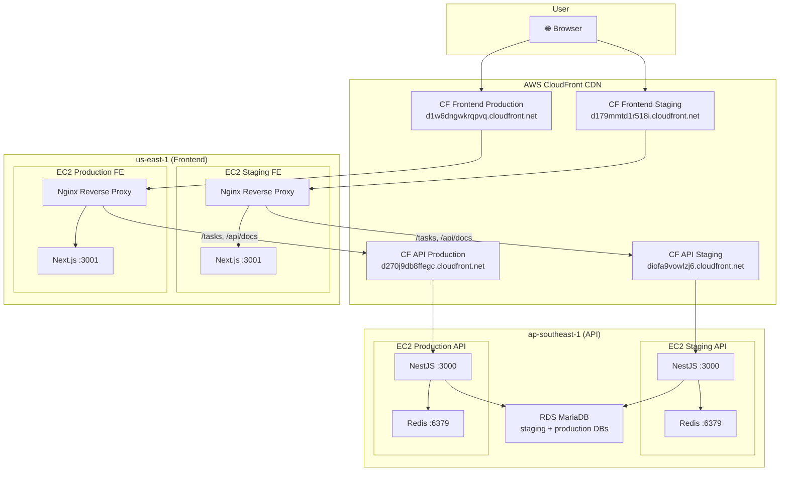
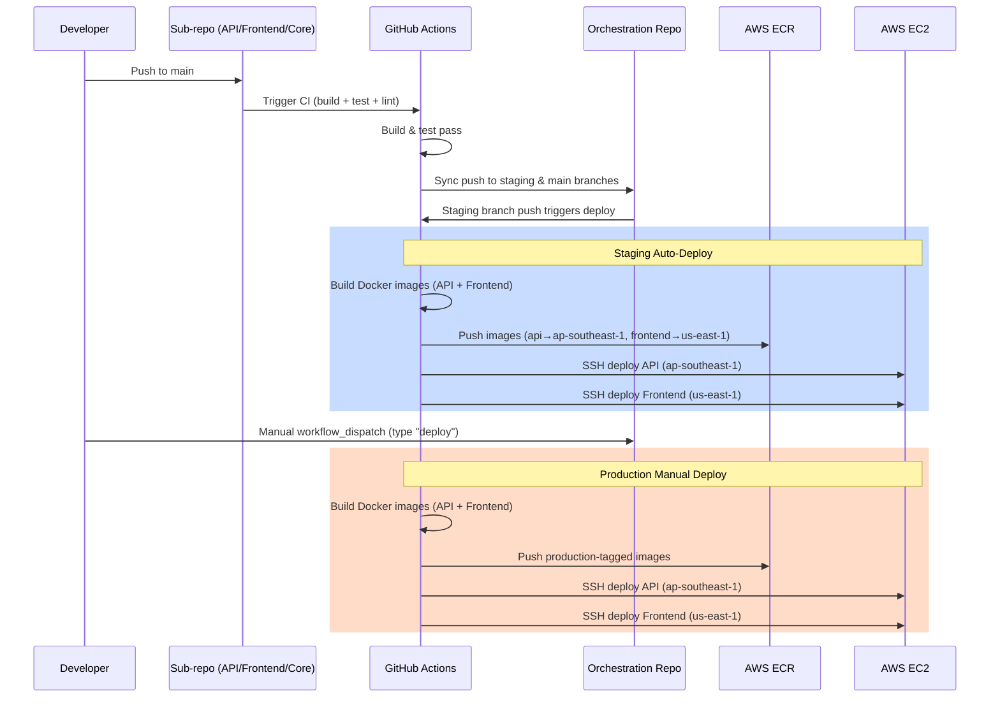

# Personal Task Tracker - Docker & CI/CD

Orchestration repository for the Personal Task Tracker project. Contains Docker Compose configurations for local development, staging, and production environments, plus GitHub Actions CI/CD workflows.

## Architecture



### Component Repositories

| Component | Repository | Tech |
|-----------|-----------|------|
| Core Logic | [personal-task-tracker-core](https://github.com/nurulizyansyaza/personal-task-tracker-core) | TypeScript npm package |
| Backend API | [personal-task-tracker-api](https://github.com/nurulizyansyaza/personal-task-tracker-api) | NestJS + TypeORM + MariaDB |
| Frontend | [personal-task-tracker-frontend](https://github.com/nurulizyansyaza/personal-task-tracker-frontend) | Next.js + Tailwind + React Query |
| Docker/CI/CD | This repo | Docker Compose + GitHub Actions |

## Quick Start (Local Development)

### Prerequisites
- Docker & Docker Compose
- Git
- Node.js 20+

### 1. Clone all repositories
```bash
mkdir personal-task-tracker-project && cd personal-task-tracker-project
git clone https://github.com/nurulizyansyaza/personal-task-tracker.git
git clone https://github.com/nurulizyansyaza/personal-task-tracker-core.git
git clone https://github.com/nurulizyansyaza/personal-task-tracker-api.git
git clone https://github.com/nurulizyansyaza/personal-task-tracker-frontend.git
```

### 2. Build core package
```bash
cd personal-task-tracker-core
npm install && npm run build
cd ..
```

### 3. Install dependencies for API and Frontend
```bash
cd personal-task-tracker-api && npm install && cd ..
cd personal-task-tracker-frontend && npm install && cd ..
```

### 4. Start with Docker Compose
```bash
cd personal-task-tracker
cp .env.local.example .env
docker compose -f docker-compose.local.yml up --build
```

### 5. Access
- **App**: http://localhost
- **API**: http://localhost:3000
- **Swagger Docs**: http://localhost:3000/api/docs

## Environments

| Environment | Compose Files | Region | Trigger |
|-------------|--------------|--------|---------|
| Local | `docker-compose.local.yml` | Local | Manual |
| Staging API | `docker-compose.api-staging.yml` | ap-southeast-1 | Auto on `staging` push |
| Staging Frontend | `docker-compose.frontend-staging.yml` | us-east-1 | Auto on `staging` push |
| Production API | `docker-compose.api-production.yml` | ap-southeast-1 | Manual `workflow_dispatch` |
| Production Frontend | `docker-compose.frontend-production.yml` | us-east-1 | Manual `workflow_dispatch` |

### Staging URLs
- **Frontend**: https://d179mmtd1r518i.cloudfront.net
- **API**: https://diofa9vowlzj6.cloudfront.net
- **Swagger**: https://diofa9vowlzj6.cloudfront.net/api/docs

### Production URLs
- **Frontend**: https://d1w6dngwkrqpvq.cloudfront.net
- **API**: https://d270j9db8ffegc.cloudfront.net
- **Swagger**: https://d270j9db8ffegc.cloudfront.net/api/docs

## CI/CD Flow



## Nginx Reverse Proxy

The frontend EC2 runs Nginx that:
- Serves the Next.js app on `/`
- Proxies `/tasks` and `/api/docs` to the API via CloudFront (cross-region)

The Nginx config uses `envsubst` templating with `API_HOST` variable.

## AWS Infrastructure

See [AWS-INFRASTRUCTURE.md](./AWS-INFRASTRUCTURE.md) for detailed multi-region setup guide including CloudFront, security groups, RDS, and ECR configuration.

## GitHub Secrets

See the [AWS Infrastructure doc](./AWS-INFRASTRUCTURE.md#github-secrets-required) for the full list of required secrets.

## Design Decisions & Trade-offs

- **Multi-region split**: API in ap-southeast-1 (close to DB), Frontend in us-east-1 (CloudFront optimized). Nginx cross-region proxy via CloudFront.
- **CloudFront CDN**: Hides EC2 IPs, provides HTTPS, caching, and DDoS protection. No dedicated domain needed.
- **Security groups locked**: EC2 ports 80/3000 only accept traffic from CloudFront managed prefix lists. SSH remains open for management.
- **Shared RDS**: One RDS instance with separate databases for staging/production to minimize costs.
- **Redis on EC2**: Runs as Docker sidecar to avoid ElastiCache costs.
- **Core package via file**: `file:../personal-task-tracker-core` dependency with symlink→copy in Docker builds.

## Future Improvements

- Add custom domain with Route 53 + ACM certificates
- Use ECS Fargate for container orchestration instead of bare EC2
- Add ElastiCache for Redis instead of Docker-hosted Redis
- Implement blue-green or rolling deployments
- Add comprehensive end to end tests with Playwright
- Set up CloudWatch dashboards and SNS alerting
- Add database migration scripts (TypeORM migrations instead of synchronize)
- Add Terraform/CDK for infrastructure-as-code
